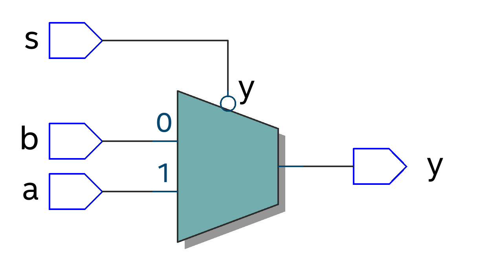
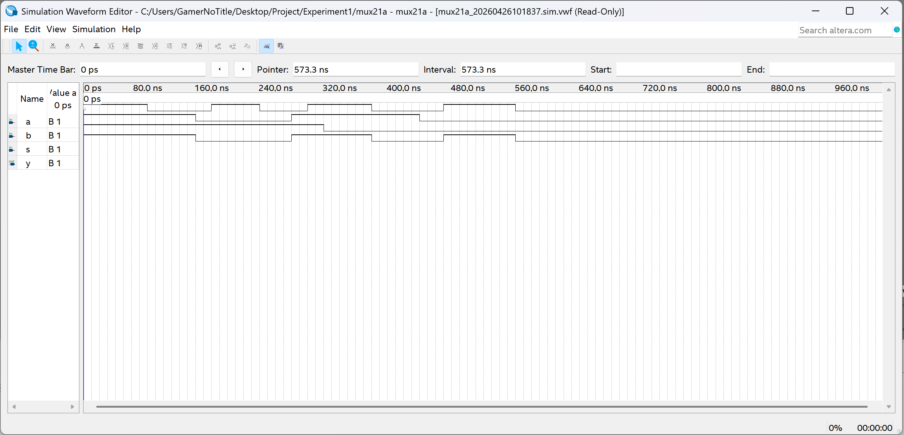

# 实验目标

题目要求参考给定的 mux21a，做出修改并补全代码，完成 mux21a 数据选择器组件的软件制作与模拟

## 题目分析

题目给出了如下的 mux21a 代码

```verilog
ENTITY mux21a IS
  PORT ( a, b, s: IN  BIT;
              y : OUT BIT  );
END ENTITY mux21a;
ARCHITECTURE one OF mux21a IS
  BEGIN
  PROCESS (a,b,s)
    BEGIN
      IF s = '0'  THEN   y <= a ;  ELSE  y <= b ;
      END IF;
  END PROCESS;
END ARCHITECTURE one ;
```

参考 EDA 的 Verilog，有类似的结构，这里规定了 `a` `b` `s` 三个输入都是比特，输出 `y` 也是比特，但是在实际的包中，因为引入的是 `IEEE.STD_LOGIC_1164`，很可能出现类型不一致的问题，后面要对齐进行修改。

题目提供的代码里面同时也缺少了上述使用到的包，要补全

## 功能分析

给定的 mux21a 实现了数据选择的功能，根据逻辑，我们可以得到元器件大致如下


当 `s=0` 时，此时选中的是 `a` 输入，输出 `y` 与输入 `a` 保持一致

当 `s=1` 时，此时选中的是 `b` 输入，输出 `y` 与输入 `b` 保持一致

## 数字逻辑实现

我们可以通过一个 `if` 判断 `s` 的状态来决定 `y` 的赋值，以实现此功能，因此我们需要对 `s` 的状态进行监听

## 真值表

|  a   |  b   |  s   |  y   |
| :--: | :--: | :--: | :--: |
|  0   |  0   |  0   |  0   |
|  0   |  0   |  1   |  0   |
|  0   |  1   |  0   |  0   |
|  0   |  1   |  1   |  1   |
|  1   |  0   |  0   |  1   |
|  1   |  0   |  1   |  0   |
|  1   |  1   |  0   |  1   |
|  1   |  1   |  1   |  1   |

# VHD 代码

```verilog
LIBRARY IEEE;
USE IEEE.STD_LOGIC_1164.ALL;

ENTITY mux21a IS
    PORT (
        a, b, s: IN STD_LOGIC;
        y: OUT STD_LOGIC
    );
END ENTITY mux21a;

ARCHITECTURE mux21a_component OF mux21a IS BEGIN
    PROCESS(a, b, s) BEGIN
        IF s = '0' THEN
            y <= a;
        ELSE
            y <= b;
        END IF;
    END PROCESS;
END ARCHITECTURE mux21a_component;
```

# 电路图



# 验证

## 波形图

手动对模拟中的输入数据进行设置，运行模拟，得到模拟波形图

