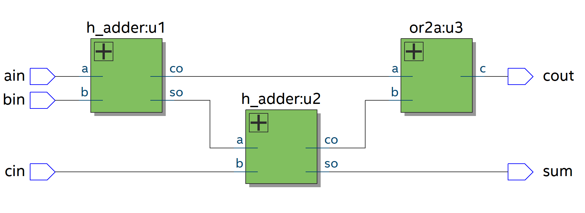
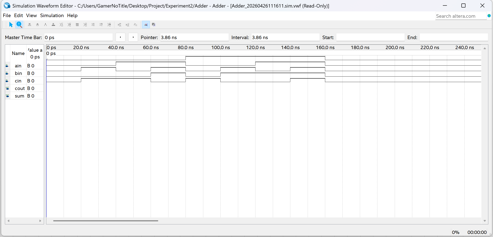

# 实验目标

题目要求参考给定的或门、半加器、全加器源码，完成一个全加器的构建与模拟

## 题目分析

题目给出了如下的代码

```verilog
-- f_adder.vhd
LIBRARY  IEEE;   --1位二进制全加器顶层设计描述
 USE IEEE.STD_LOGIC_1164.ALL;
 ENTITY f_adder IS
   PORT (ain, bin,  cin : IN STD_LOGIC;
               cout, sum : OUT STD_LOGIC);
 END ENTITY f_adder;
 ARCHITECTURE fd1 OF f_adder IS
   COMPONENT h_adder                  --调用半加器声明语句
     PORT (  a, b : IN STD_LOGIC;
            co, so : OUT STD_LOGIC);
   END COMPONENT;
   COMPONENT or2a
      PORT (a, b : IN STD_LOGIC;
               c : OUT STD_LOGIC);
   END COMPONENT;
SIGNAL d, e, f : STD_LOGIC; --定义3个信号作为内部的连接线
  BEGIN
   u1 : h_adder PORT MAP(a=>ain, b=>bin, co=>d, so=>e);  --例化语句
   u2 : h_adder PORT MAP(a=>e, b=>cin, co=>f, so=>sum);
   u3 : or2a    PORT MAP(a=>d, b=>f, c=>cout);
 END ARCHITECTURE fd1;
```

```verilog
-- h_adder.vhd
LIBRARY  IEEE;   --半加器描述(2)：真值表描述方法
USE IEEE.STD_LOGIC_1164.ALL;
ENTITY h_adder IS
PORT (a, b : IN STD_LOGIC; 
     co, so : OUT STD_LOGIC); 
END ENTITY h_adder;    
ARCHITECTURE fh1 OF h_adder IS 
SIGNAL abc : STD_LOGIC_VECTOR(1 DOWNTO 0);
                          --定义标准逻辑位矢量数据类型
BEGIN
  abc <= a & b ;   --a相并b, 即a与b并置操作
 PROCESS(abc)
  BEGIN
   CASE abc IS      --类似于真值表的CASE语句
    WHEN "00" => so<='0'; co<='0' ;
    WHEN "01" => so<='1'; co<='0' ;
    WHEN "10" => so<='1'; co<='0' ;
    WHEN "11" => so<='0'; co<='1' ;
    WHEN OTHERS => NULL ;
   END CASE;
 END PROCESS;
END ARCHITECTURE fh1 ;
```

```verilog
-- or2a.vhd
LIBRARY  IEEE ;   --或门逻辑描述
 USE IEEE.STD_LOGIC_1164.ALL;
 ENTITY or2a IS
   PORT (a, b : IN STD_LOGIC;  c : OUT STD_LOGIC );
 END ENTITY or2a ;
 ARCHITECTURE one OF or2a IS
   BEGIN
   c <= a OR b ;
 END ARCHITECTURE one ;
```

可以看到的是，题目设定一个全加器里面含有两个半加器、一个或门，最终输出的结果应为 `cout` 和 `sum`

## 功能分析

根据题目信息，我们可以得到类似如下的电路图



通过题目提供的源码，我们可以知道

- `cout = (ain & bin) + (cin & (ain ⊕ bin))`
- `sum = ain ⊕ bin ⊕ cin`

## 数字逻辑实现

在数字逻辑上，我们只需要把对应的组件逻辑表达式做好，并用全加器组合起来即可

而在组件上，有或门

- `c = a | b`

半加器有

- `so = a ⊕ b`
- `co = a & b`

## 真值表

| ain  | bin  | cin  | sum (和) | cout (进位) |
| :--: | :--: | :--: | :------: | :---------: |
|  0   |  0   |  0   |  **0**   |    **0**    |
|  0   |  0   |  1   |  **1**   |    **0**    |
|  0   |  1   |  0   |  **1**   |    **0**    |
|  0   |  1   |  1   |  **0**   |    **1**    |
|  1   |  0   |  0   |  **1**   |    **0**    |
|  1   |  0   |  1   |  **0**   |    **1**    |
|  1   |  1   |  0   |  **0**   |    **1**    |
|  1   |  1   |  1   |  **1**   |    **1**    |

# VHD 代码

### 或门 or2a.vhd

```verilog
LIBRARY IEEE;
USE IEEE.STD_LOGIC_1164.ALL;

ENTITY or2a IS PORT (
    a, b: IN STD_LOGIC;  
    c: OUT STD_LOGIC
    );
END ENTITY or2a;

ARCHITECTURE orGate OF or2a IS BEGIN
    c <= a OR b ;   -- 或门置值
END ARCHITECTURE orGate;
```

### 半加器 halfAdder.vhd

```verilog
LIBRARY IEEE;
USE IEEE.STD_LOGIC_1164.ALL;

ENTITY h_adder IS PORT (
    a, b : IN STD_LOGIC; 
    co, so : OUT STD_LOGIC
    ); 
END ENTITY h_adder;    

ARCHITECTURE halfAdder OF h_adder IS SIGNAL 
    abc: STD_LOGIC_VECTOR(1 DOWNTO 0);
BEGIN
    abc <= a & b ;
    PROCESS(abc) BEGIN
        CASE abc IS
            WHEN "00" =>
                so<='0';
                co<='0';
            WHEN "01" =>
                so<='1';
                co<='0';
            WHEN "10" =>
                so<='1';
                co<='0';
            WHEN "11" =>
                so<='0';
                co<='1';
            WHEN OTHERS => NULL;
        END CASE;
    END PROCESS;
END ARCHITECTURE halfAdder;
```

### 全加器 Adder.vhd

```verilog
LIBRARY IEEE;
USE IEEE.STD_LOGIC_1164.ALL;

ENTITY Adder IS PORT (
    ain, bin, cin: IN STD_LOGIC;
    cout, sum: OUT STD_LOGIC
    );
END ENTITY Adder;

ARCHITECTURE FullAdder OF FullAdder IS
    COMPONENT h_adder PORT (    -- 新建半加器组件
        a, b: IN STD_LOGIC;
        co, so: OUT STD_LOGIC
        );
    END COMPONENT;

    COMPONENT or2a PORT (   -- 新建或门组件
        a, b: IN STD_LOGIC;
        c: OUT STD_LOGIC
        );
    END COMPONENT;

SIGNAL d, e, f: STD_LOGIC; BEGIN    --定义3个信号作为内部的连接线
    u1: h_adder PORT MAP(a=>ain, b=>bin, co=>d, so=>e);  -- 实例化第一个半加器，连接输入和中间信号
    u2: h_adder PORT MAP(a=>e, b=>cin, co=>f, so=>sum);  -- 实例化第二个半加器，连接第一个半加器的和输出和进位输入
    u3: or2a    PORT MAP(a=>d, b=>f, c=>cout);     -- 实例化或门，连接两个半加器的进位输出，得到最终的进位输出
END ARCHITECTURE FullAdder;
```

# 电路图


# 验证

## 波形图

手动对模拟中的输入数据进行设置，运行模拟，得到模拟波形图

