# 8 位模型计算机的设计与实现 

## 实验目的

模型机是计算机的缩细模型，通过它可以理解计算机整机的结构及功能，理解 CPU、存储器、中断控制器、接口的结构及实现逻辑和各部件之间的接口关系。本次课程设计的主要内容是利用 Intel 公司的 EPF10K10LC84-4 的内部可编程资源，设计一个 8 位模型计算机。本课程设计的主要目的是通过部件级的 8 位模型机的设计和调试，使学生掌握计算机工作中“时间—空间”概念的理解，从而清晰地建立计算机的整机概念，并培养学生分析和解决实际问题的能力，同时增强学生的动手能力。

## 功能分析

八位硬布线 CPU 中包含有下面几个部件

- ALU 运算器
- IR 指令寄存器
- PC 程序计数器
- RAM 存储器
- ACC 累加器
- Controller 控制器

其中，ALU 运算器负责执行各种运算操作，IR 指令寄存器负责存储当前需要执行的命令，PC 程序计数器在每执行一条指令后自增以推进程序的运行，RAM 存储器存储了需要执行的指令，或者记录程序运行的结果。ACC 累加器作为所有运算的中转站，需要对数据进行不断的传递。控制器作为与外部交互的组件，接受来自外界的输入。

## 设计方案

对于一个指令周期，我们可以将它分为取指、译码、执行这三个阶段。

在取指阶段，PC 将指令的目标地址传递给 RAM，RAM 收到后，将对应地址的指令传递给 IR，IR 接受需要执行的指令，取指阶段结束。此时取指得到的指令中，包含了指令和操作数的相关信息，在这里我们设计的背景预设下，为操作数在 RAM 中的地址。

在译码阶段，IR 拿到指令的指令包含两部分，为 4 Bit + 4 Bit 结构的内容，其中对于指令来说，前 4 bit 为对应的指令，而后 4 bit 为对应的操作数地址。指令的定义如下

| 指令名称 | 操作码 (4 Bits) | 操作数 (4 Bits) | 描述 |
| :------: | :-------------: | :-------------: | :--- |
| **LOAD** | 0000 (0) | 地址 $X$ | 将存储器 $X$ 单元的内容加载到累加器 ACC 中 |
| **STORE** | 0001 (1) | 地址 $X$ | 将累加器 ACC 的内容存入存储器 $X$ 单元中 |
| **ADD** | 0010 (2) | 地址 $X$ | 将 ACC 的内容与存储器 $X$ 单元的内容相加，结果存入 ACC |
| **SUB** | 0011 (3) | 地址 $X$ | 将 ACC 的内容减去存储器 $X$ 单元的内容，结果存入 ACC |
| **MUL** | 0100 (4) | 地址 $X$ | 将 ACC 的内容与存储器 $X$ 单元的内容相乘，结果存入 ACC |
| **DIV** | 0101 (5) | 地址 $X$ | 将 ACC 的内容除以存储器 $X$ 单元的内容，结果存入 ACC |
| **NEG** | 0110 (6) | 0000 | 对累加器 ACC 中的数值取补码（取反加一/变负数） |
| **AND** | 0111 (7) | 地址 $X$ | 将 ACC 的内容与存储器 $X$ 单元的内容进行逻辑“与”运算 |
| **OR** | 1000 (8) | 地址 $X$ | 将 ACC 的内容与存储器 $X$ 单元的内容进行逻辑“或”运算 |
| **NOT** | 1001 (9) | 地址 $X$ | 将存储器 $X$ 单元的内容取反后送入累加器 ACC |
| **HALT** | 1010 (A) | 0001 | 停止指令，CPU 进入停机状态，停止取指和执行 |
| **BRANCH** | 1011 (B) | 地址 $X$ | 无条件跳转指令，将程序计数器 PC 设置为地址 $X$ |

即大多数指令的操作数为对应的地址，但是存在特殊的约束

- NEG 取补码指令，约定操作数必须为 0
- HALT 停机指令，约定操作数必须为 1

IR 拿到指令后，依据上表进行解析，将操作码传递给控制器，控制器对 CPU 的状态进行置换，此时的控制器可以视作是数字逻辑电路设计中的有限状态机，同时也接受来自外部的复位 Reset 输入。控制器同时也承担着协调各个组件运作的核心作用。对于控制器的作用说明如下

| IR 指令类型 |            控制信号输出             |                 描述                  |
| :---------: | :---------------------------------: | :-----------------------------------: |
|  **FETCH**  |     pc_enA=1, ir_ld=1, pc_inc=1     |  将指令从内存搬运至 IR，PC 自动加 1   |
|  **LOAD**   |    ir_enA=1, mem_enD=1, acc_ld=1    |  将操作数地址对应的内存值载入累加器   |
|  **STORE**  |    ir_enA=1, acc_enD=1, mem_rw=0    | 将累加器的值写入操作数地址对应的内存  |
|   **ADD**   | alu_op=0000, acc_selAlu=1, acc_ld=1 | 将内存操作数与 ACC 相加，结果存回 ACC |
|  **HALT**   |         状态进入 halt 循环          |         CPU 停止一切取指动作          |

在执行阶段，根据指令的不同，各部件的行为也不同

- LOAD：收到 LOAD 指令后，从 RAM 的地址 $\$X$ 中把对应的操作数拿出来，传递给累加器 ACC
- STORE：收到 STORE 指令后，累加器 ACC 的操作数会被存入 RAM 中地址为 $\$X$ 的存储单元
- ADD/SUB/MUL/DIV/AND/OR/NOT：从 RAM 的地址 $\$X$ 中取出对应的数字，然后与当前在 ACC 内的数字进行对应的运算
- HALT：当操作数为 `1` 时，无条件停机
- NEG：无需传入操作数，要求操作数始终置零，直接作用于 ACC 内的数字，对其取补码
- BRANCH：IR 将操作数视为跳转地址，直接送至 PC，激活 `pc_ld` 信号，直接对 PC 的内置计数器进行置位操作，从而实现无条件跳转

## 代码实现

### ACC 累加器

```vhdl
LIBRARY IEEE;
USE IEEE.STD_LOGIC_1164.ALL;
USE IEEE.STD_LOGIC_UNSIGNED.ALL;

ENTITY accumulator IS PORT (                    -- 声明外部实体接口
    clk, en_D, ld, selAlu, reset: IN STD_LOGIC; -- 时钟信号，使能信号，加载信号，选择ALU输出信号，复位信号
    aluD: IN STD_LOGIC_VECTOR(7 DOWNTO 0);  -- ALU 输出数据总线
    dBus: INOUT STD_LOGIC_VECTOR(7 DOWNTO 0);   -- 数据总线，双向
    q: OUT STD_LOGIC_VECTOR(7 DOWNTO 0)     -- 累加器输出端口
);
END accumulator;

ARCHITECTURE accArch OF accumulator IS
    SIGNAL accReg: STD_LOGIC_VECTOR(7 DOWNTO 0);
BEGIN
    PROCESS(clk) BEGIN
        IF clk'event AND clk = '1' THEN
            IF reset = '1' THEN
                accReg <= "00000000";
            ELSIF ld = '1' AND selAlu = '1' THEN
                accReg <= aluD;
            ELSIF ld = '1' AND selAlu = '0' THEN
                accReg <= dBus;
            END IF;
        END IF;
    END PROCESS;

    dBus <= accReg WHEN en_D = '1' ELSE "ZZZZZZZZ";
    q <= accReg;
END accArch;

```

### ALU 运算器

```vhdl
LIBRARY IEEE;
USE IEEE.STD_LOGIC_1164.ALL;
USE IEEE.STD_LOGIC_UNSIGNED.ALL;

ENTITY alu IS PORT (                            -- 实体声明外部接口
    op: IN STD_LOGIC_VECTOR(3 DOWNTO 0);        -- 选择控制运算类型
    accD: IN STD_LOGIC_VECTOR(7 DOWNTO 0);      -- 累加器的 8 位数据
    dBus: IN STD_LOGIC_VECTOR(7 DOWNTO 0);      -- 数据总线用于运算
    result: OUT STD_LOGIC_VECTOR(7 DOWNTO 0);   -- 结果的输出
    accZ: OUT STD_LOGIC
);
END alu;

ARCHITECTURE aluArch OF alu IS BEGIN
    PROCESS (op, accD, dBus) 
        VARIABLE tmpResult: STD_LOGIC_VECTOR(15 DOWNTO 0); -- 用于存储乘法结果
    BEGIN
        CASE op IS
            WHEN "0000" => -- 取反加一为负数
                result <= (NOT accD) + "00000001";
            WHEN "0001" => -- 加法
                result <= accD + dBus;
            WHEN "0010" => -- +128
                result <= accD + "10000000";
            WHEN "0011" => -- 总线 +128
                result <= dBus + "10000000";
            WHEN "0100" => -- 取反减一
                result <= (NOT accD) - "00000001";
            WHEN "0101" => -- 减法
                result <= accD - dBus;
            WHEN "0110" => -- 乘法
                tmpResult := (accD * dBus); -- 乘法会扩张到 16 位
                result <= tmpResult(7 DOWNTO 0); -- 取低 8 位作为结果
            WHEN "0111" => -- 累加器乘以数据总线的取反
                tmpResult := (accD * (NOT dBus));   -- 处理同上，懒得再写了
                result <= tmpResult(7 DOWNTO 0);
            WHEN "1010" => -- 位与
                result <= accD AND dBus;
            WHEN "1011" => -- 位与非
                result <= accD NAND dBus;
            WHEN "1100" => -- 位或
                result <= accD OR dBus;
            WHEN "1101" => -- 位或非
                result <= accD NOR dBus;
            WHEN "1110" => -- 位异或
                result <= accD XNOR dBus;
            WHEN "1111" => -- 位非
                result <= NOT accD;
            WHEN OTHERS =>
                result <= "00000000"; -- 默认输出为0
        END CASE;
    END PROCESS;

    accZ <= NOT (accD(0) OR accD(1) OR accD(2) OR accD(3) OR
        accD(4) OR accD(5) OR accD(6) OR accD(7));
END aluArch;

```

### Controller 控制器

```vhdl
LIBRARY IEEE;
USE IEEE.STD_LOGIC_1164.ALL;

ENTITY controller IS PORT (                     -- 声明实体外部接口
    clk, reset: IN STD_LOGIC;
    mem_enD, mem_rw: OUT STD_LOGIC;
    pc_enA, pc_ld, pc_inc: OUT STD_LOGIC;
    ir_enA, ir_enD, ir_ld: OUT STD_LOGIC;
    ir_load, ir_store, ir_add: IN STD_LOGIC;
    ir_sub, ir_mul, ir_div: IN STD_LOGIC;
    ir_and, ir_or, ir_not: IN STD_LOGIC;
    ir_neg, ir_halt, ir_branch: IN STD_LOGIC;
    acc_enD, acc_ld, acc_selAlu: OUT STD_LOGIC;
    alu_op: OUT STD_LOGIC_VECTOR(3 DOWNTO 0);
    state_out: OUT STD_LOGIC_VECTOR(4 DOWNTO 0) -- 输出当前状态，便于调试
);
END controller;

ARCHITECTURE controllerArch OF controller IS
    TYPE state_type IS (
        reset_state,
        fetch0, fetch1,
        load0, load1,
        store0, store1,
        add0, add1,
        sub0, sub1,
        mul0, mul1,
        div0, div1,
        and0, and1,
        or0, or1,
        not0, not1,
        negate0, negate1,
        halt,
        branch0, branch1
    );
    SIGNAL state: state_type;
BEGIN
    PROCESS(clk) BEGIN
        IF clk'event AND clk = '1' THEN
            IF reset = '1' THEN
                state <= reset_state;
            ELSE
                CASE state IS
                    WHEN reset_state => state <= fetch0;
                    WHEN fetch0 => state <= fetch1;
                    WHEN fetch1 =>
                        IF ir_load = '1' THEN state <= load0;
                        ELSIF ir_store = '1' THEN state <= store0;
                        ELSIF ir_add = '1' THEN state <= add0;
                        ELSIF ir_sub = '1' THEN state <= sub0;
                        ELSIF ir_mul = '1' THEN state <= mul0;
                        ELSIF ir_div = '1' THEN state <= div0;
                        ELSIF ir_and = '1' THEN state <= and0;
                        ELSIF ir_or = '1' THEN state <= or0;
                        ELSIF ir_not = '1' THEN state <= not0;
                        ELSIF ir_neg = '1' THEN state <= negate0;
                        ELSIF ir_halt = '1' THEN state <= halt;
                        ELSIF ir_branch = '1' THEN state <= branch0;
                        END IF;
                    WHEN load0 => state <= load1;
                    WHEN load1 => state <= fetch0;
                    WHEN store0 => state <= store1;
                    WHEN store1 => state <= fetch0;
                    WHEN add0 => state <= add1;
                    WHEN add1 => state <= fetch0;
                    WHEN sub0 => state <= sub1;
                    WHEN sub1 => state <= fetch0;
                    WHEN mul0 => state <= mul1;
                    WHEN mul1 => state <= fetch0;
                    WHEN div0 => state <= div1;
                    WHEN div1 => state <= fetch0;
                    WHEN and0 => state <= and1;
                    WHEN and1 => state <= fetch0;
                    WHEN or0 => state <= or1;
                    WHEN or1 => state <= fetch0;
                    WHEN not0 => state <= not1;
                    WHEN not1 => state <= fetch0;
                    WHEN negate0 => state <= negate1;
                    WHEN negate1 => state <= fetch0;
                    WHEN halt => state <= halt;
                    WHEN branch0 => state <= branch1;
                    WHEN branch1 => state <= fetch0;
                    WHEN OTHERS => state <= halt;
                END CASE;
            END IF;
        END IF;
    END PROCESS;

    PROCESS(clk) BEGIN                          -- special process for memory write timing
        IF clk'event AND clk = '0' THEN
            IF state = store0 THEN
                mem_rw <= '0';
            ELSE
                mem_rw <= '1';
            END IF;
        END IF;
    END PROCESS;

    state_out <= 
        "00000" WHEN state = reset_state ELSE   -- 0 -> reset_state
        "00001" WHEN state = fetch0 ELSE        -- 1 -> fetch0
        "00010" WHEN state = fetch1 ELSE        -- 2 -> fetch1
        "00011" WHEN state = load0 ELSE         -- 3 -> load0
        "00100" WHEN state = load1 ELSE         -- 4 -> load1
        "00101" WHEN state = store0 ELSE        -- 5 -> store0
        "00110" WHEN state = store1 ELSE        -- 6 -> store1
        "00111" WHEN state = add0 ELSE          -- 7 -> add0
        "01000" WHEN state = add1 ELSE          -- 8 -> add1
        "01001" WHEN state = sub0 ELSE          -- 9 -> sub0
        "01010" WHEN state = sub1 ELSE          -- A -> sub1
        "01111" WHEN state = halt ELSE          -- F -> halt
        "11111";        -- 31 -> Invalid state

    mem_enD <= '1' WHEN state = fetch0 OR state = fetch1 OR
        state = load0 OR state = load1 OR
        state = add0 OR state = add1 OR
        state = sub0 OR state = sub1 OR
        state = mul0 OR state = mul1 OR
        state = div0 OR state = div1 OR
        state = and0 OR state = and1 OR
        state = or0 OR state = or1 ELSE '0';

    pc_enA <= '1' WHEN state = fetch0 OR state = fetch1 ELSE '0';
    pc_ld <= '1' WHEN state = branch0 ELSE '0';
    pc_inc <= '1' WHEN state = fetch1 ELSE '0';

    ir_enA <= '1' WHEN state = load0 OR state = load1 OR
        state = store0 OR state = store1 OR
        state = add0 OR state = add1 OR
        state = sub0 OR state = sub1 OR
        state = mul0 OR state = mul1 OR
        state = div0 OR state = div1 OR
        state = and0 OR state = and1 OR
        state = or0 OR state = or1 ELSE '0';
    ir_enD <= '1' WHEN state = branch0 ELSE '0';
    ir_ld <= '1' WHEN state = fetch1 ELSE '0';

    acc_enD <= '1' WHEN state = store0 OR state = store1 ELSE '0';
    acc_ld <= '1' WHEN state = load1 OR state = add1 OR state = negate1 OR
        state = sub1 OR state = mul1 OR state = div1 OR
        state = not1 OR state = or1 ELSE '0';

    acc_selAlu <= '1' WHEN state = add1 OR state = negate1 OR state = sub1 OR
        state = mul1 OR state = div1 OR state = not1 OR
        state = or1 ELSE '0';

    alu_op <= "0000" WHEN state = add0 OR state = add1 ELSE
        "0001" WHEN state = sub0 OR state = sub1 ELSE
        "0010" WHEN state = mul0 OR state = mul1 ELSE
        "0011" WHEN state = div0 OR state = div1 ELSE
        "0100" WHEN state = negate0 OR state = negate1 ELSE
        "0101" WHEN state = and0 OR state = and1 ELSE
        "0110" WHEN state = or0 OR state = or1 ELSE
        "0111" WHEN state = not0 OR state = not1;
END controllerArch;

```

### IR 指令寄存器

```vhdl
LIBRARY IEEE;
USE IEEE.STD_LOGIC_1164.ALL;

ENTITY instruction_register IS PORT (           -- 声明实体外部接口
    clk, en_A, en_D, ld, reset: IN STD_LOGIC;
    aBus: OUT STD_LOGIC_VECTOR(7 DOWNTO 0);     -- 数据总线输出
    dBus: INOUT STD_LOGIC_VECTOR(7 DOWNTO 0);
    load, store, add, sub, mul, div, andd, orr, nott, neg, halt, branch: OUT STD_LOGIC
);
END instruction_register;

ARCHITECTURE irArch OF instruction_register IS
    SIGNAL irReg: STD_LOGIC_VECTOR(7 DOWNTO 0);
BEGIN
    PROCESS(clk) BEGIN
        IF clk'event AND clk = '0' THEN        -- load on falling edge
            IF reset = '1' THEN
                irReg <= "00000000";
            ELSIF ld = '1' THEN
                irReg <= dBus;
            END IF;
        END IF;
    END PROCESS;

    aBus <= "0000" & irReg(3 DOWNTO 0) WHEN en_A = '1' ELSE
        "ZZZZZZZZ";
    dBus <= "0000" & irReg(3 DOWNTO 0) WHEN en_D = '1' ELSE
        "ZZZZZZZZ";
    -- 指令集，吃掉 ram 过来的高 4 位
    load    <= '1' WHEN irReg(7 DOWNTO 4) = "0000" ELSE '0';    -- OpCode = 0
    store   <= '1' WHEN irReg(7 DOWNTO 4) = "0001" ELSE '0';    -- OpCode = 1
    add     <= '1' WHEN irReg(7 DOWNTO 4) = "0010" ELSE '0';    -- OpCode = 2
    sub     <= '1' WHEN irReg(7 DOWNTO 4) = "0011" ELSE '0';    -- OpCode = 3
    mul     <= '1' WHEN irReg(7 DOWNTO 4) = "0100" ELSE '0';    -- OpCode = 4
    div     <= '1' WHEN irReg(7 DOWNTO 4) = "0101" ELSE '0';    -- OpCode = 5
    neg     <= '1' WHEN irReg = "0110" & "0000" ELSE '0';       -- OpCode = 6, Operand = 0
    andd    <= '1' WHEN irReg(7 DOWNTO 4) = "0111" ELSE '0';    -- OpCode = 7
    orr     <= '1' WHEN irReg(7 DOWNTO 4) = "1000" ELSE '0';    -- OpCode = 8
    nott    <= '1' WHEN irReg(7 DOWNTO 4) = "1001" ELSE '0';    -- OpCode = 9
    halt    <= '1' WHEN irReg = "1010" & "0001" ELSE '0';       -- OpCode = A, Operand = 1
    branch  <= '1' WHEN irReg(7 DOWNTO 4) = "1011" ELSE '0';    -- OpCode = B
END irArch;

```

### PC 程序计数器

```vhdl
LIBRARY IEEE;
USE IEEE.STD_LOGIC_1164.ALL;
USE IEEE.STD_LOGIC_UNSIGNED.ALL;

ENTITY program_counter IS PORT (
    clk, en_A, ld, inc, reset: IN STD_LOGIC;
    aBus: OUT STD_LOGIC_VECTOR(7 DOWNTO 0);     -- 数据总线输出
    dBus: IN STD_LOGIC_VECTOR(7 DOWNTO 0)       -- 数据总线输入
);
END program_counter;

ARCHITECTURE pcArch OF program_counter IS
    SIGNAL pcReg: STD_LOGIC_VECTOR(7 DOWNTO 0);
BEGIN
    PROCESS(clk) BEGIN
        IF clk'event AND clk = '1' THEN
            IF reset = '1' THEN
                pcReg <= "00000000";
            ELSIF ld = '1' THEN
                pcReg <= dBus;
            ELSIF inc = '1' THEN
                pcReg <= pcReg + "00000001";
            END IF;
        END IF;
    END PROCESS;

    aBus <= pcReg WHEN en_A = '1' ELSE "ZZZZZZZZ";
END pcArch;

```

### RAM 存储器

```vhdl
LIBRARY IEEE;
USE IEEE.STD_LOGIC_1164.ALL;
USE IEEE.STD_LOGIC_ARITH.ALL;

ENTITY ram IS PORT (
    r_w, en, reset: IN STD_LOGIC;
    aBus: IN STD_LOGIC_VECTOR(7 DOWNTO 0);      -- 数据总线输入
    dBus: INOUT STD_LOGIC_VECTOR(7 DOWNTO 0)
);
END ram;

ARCHITECTURE ramArch OF ram IS
    TYPE ram_typ IS ARRAY(0 TO 63) OF STD_LOGIC_VECTOR(7 DOWNTO 0);     -- 64 条指令，每条指令 8 位
    SIGNAL ram: ram_typ;
BEGIN
    PROCESS(en, reset, r_w, aBus, dBus) BEGIN
        IF reset = '1' THEN     -- Operand to address bus for finding the real operand with address
            ram(0) <= x"06";    -- Load [$6] => acc = 24
            ram(1) <= x"27";    -- [$6] + [$7] => 24 + 43 = 67
            ram(2) <= x"38";    -- acc - [$8] => 67 - 33 = 34
            ram(3) <= x"15";    -- Store [$5] <= 34
            ram(4) <= x"A1";    -- Halt
            ram(5) <= x"00";    -- Padding Empty
            ram(6) <= x"18";    -- 预存 24
            ram(7) <= x"2B";    -- 预存 43
            ram(8) <= x"21";    -- 预存 33

        ELSIF r_w = '0' THEN    -- rw = 0 写入模式，转为 int 类型写入
            ram(conv_integer(unsigned(aBus))) <= dBus;
        END IF;
    END PROCESS;

    dBus <= ram(conv_integer(unsigned(aBus)))
        WHEN reset = '0' AND en = '1' AND r_w = '1' ELSE
        "ZZZZZZZZ";
END ramArch;

```

### 顶层封装

```vhdl
LIBRARY IEEE;
USE IEEE.STD_LOGIC_1164.ALL;

ENTITY top_level IS PORT (                      -- 声明实体外部接口
    clk, reset: IN STD_LOGIC;   -- 时钟信号、复位信号
    abusX: OUT STD_LOGIC_VECTOR(7 DOWNTO 0);    -- 地址总线输出
    dbusX: OUT STD_LOGIC_VECTOR(7 DOWNTO 0);    -- 数据总线输出
    mem_enDX, mem_rwX: OUT STD_LOGIC;   -- 内存使能信号、内存读写信号输出
    pc_enAX, pc_ldX, pc_incX: OUT STD_LOGIC;    -- 程序计数器使能信号、程序计数器加载信号、程序计数器自增信号输出
    ir_enAX, ir_enDX, ir_ldX: OUT STD_LOGIC;    -- 指令寄存器使能信号A、指令寄存器使能信号D、指令寄存器加载信号输出
    acc_enDX, acc_ldX, acc_selAluX: OUT STD_LOGIC;   -- 累加器使能信号、累加器加载信号、累加器 ALU 选择信号输出
    acc_QX: OUT STD_LOGIC_VECTOR(7 DOWNTO 0);    -- 累加器输出
    alu_accZX: OUT STD_LOGIC;    -- ALU 零标志输出
    alu_opX: OUT STD_LOGIC_VECTOR(3 DOWNTO 0);    -- ALU 运算类型输出
    stateX: OUT STD_LOGIC_VECTOR(4 DOWNTO 0) -- 当前状态输出
);
END top_level;

ARCHITECTURE topArch OF top_level IS
    COMPONENT program_counter PORT (
        -- 时钟信号、使能信号、加载信号、自增信号、复位信号 = program_counter.clk .en_A .ld .inc .reset
        clk, en_A, ld, inc, reset: IN STD_LOGIC;
        aBus: OUT STD_LOGIC_VECTOR(7 DOWNTO 0);
        dBus: IN STD_LOGIC_VECTOR(7 DOWNTO 0)
    );
    END COMPONENT;

    COMPONENT instruction_register PORT (
        -- 时钟信号、双使能信号、加载信号、复位信号 = instruction_register.clk .en_A .en_D .ld .reset
        clk, en_A, en_D, ld, reset: IN STD_LOGIC;
        aBus: OUT STD_LOGIC_VECTOR(7 DOWNTO 0);
        dBus: INOUT STD_LOGIC_VECTOR(7 DOWNTO 0);
        load, store, add, sub, mul, div, neg, andd, orr, nott, halt, branch: OUT STD_LOGIC
    );
    END COMPONENT;

    COMPONENT accumulator PORT (
        -- 时钟信号、使能信号、加载信号、ALU 选择信号、复位信号 = accumulator.clk .en_D .ld .selAlu .reset
        clk, en_D, ld, selAlu, reset: IN STD_LOGIC;
        aluD: IN STD_LOGIC_VECTOR(7 DOWNTO 0);
        dBus: INOUT STD_LOGIC_VECTOR(7 DOWNTO 0);
        q: OUT STD_LOGIC_VECTOR(7 DOWNTO 0)
    );
    END COMPONENT;

    COMPONENT alu PORT (
        -- 运算类型、累加器输入、数据总线输入、运算结果输出、零标志输出 = alu.op .accD .dBus .result .accZ
        op: IN STD_LOGIC_VECTOR(3 DOWNTO 0);
        accD: IN STD_LOGIC_VECTOR(7 DOWNTO 0);
        dBus: IN STD_LOGIC_VECTOR(7 DOWNTO 0);
        result: OUT STD_LOGIC_VECTOR(7 DOWNTO 0);
        accZ: OUT STD_LOGIC
    );
    END COMPONENT;

    COMPONENT ram PORT (
        -- 读写模式、使能信号、复位信号 = ram.r_w .ram_enD .reset
        r_w, en, reset: IN STD_LOGIC;
        aBus: IN STD_LOGIC_VECTOR(7 DOWNTO 0);
        dBus: INOUT STD_LOGIC_VECTOR(7 DOWNTO 0)
    );
    END COMPONENT;

    COMPONENT controller PORT (
        clk, reset: IN STD_LOGIC;   -- 时钟信号、复位信号
        mem_enD, mem_rw: OUT STD_LOGIC;     -- 内存使能信号、内存读写信号
        pc_enA, pc_ld, pc_inc: OUT STD_LOGIC;   -- 程序计数器使能信号、程序计数器加载信号、程序计数器自增信号
        ir_enA, ir_enD, ir_ld: OUT STD_LOGIC;   -- 指令寄存器使能信号A、指令寄存器使能信号D、指令寄存器加载信号
        ir_load, ir_store, ir_add: IN STD_LOGIC;    -- 指令寄存器加载指令、存储指令、加法指令
        ir_sub, ir_mul, ir_div: IN STD_LOGIC;   -- 指令寄存器减法指令、乘法指令、除法指令
        ir_and, ir_or, ir_not: IN STD_LOGIC;    -- 指令寄存器与指令、或指令、非指令
        ir_neg, ir_halt, ir_branch: IN STD_LOGIC;   -- 指令寄存器取反指令、停止指令、分支指令
        acc_enD, acc_ld, acc_selAlu: OUT STD_LOGIC;     -- 累加器使能信号、累加器加载信号、累加器 ALU 选择信号
        alu_op: OUT STD_LOGIC_VECTOR(3 DOWNTO 0);    -- ALU 运算类型输出
        state_out: OUT STD_LOGIC_VECTOR(4 DOWNTO 0)
    );
    END COMPONENT;

    SIGNAL abus: STD_LOGIC_VECTOR(7 DOWNTO 0);  -- 地址总线
    SIGNAL dbus: STD_LOGIC_VECTOR(7 DOWNTO 0);  -- 数据总线
    SIGNAL mem_enD, mem_rw: STD_LOGIC;  -- 内存使能信号、内存读写信号
    SIGNAL pc_enA, pc_ld, pc_inc: STD_LOGIC;    -- 程序计数器使能信号、程序计数器加载信号、程序计数器自增信号
    SIGNAL ir_enA, ir_enD, ir_ld: STD_LOGIC;    -- 指令寄存器使能信号A、指令寄存器使能信号D、指令寄存器加载信号
    SIGNAL ir_load, ir_store, ir_add: STD_LOGIC;    -- 指令寄存器加载指令、存储指令、加法指令
    SIGNAL ir_sub, ir_mul, ir_div: STD_LOGIC;   -- 指令寄存器减法指令、乘法指令、除法指令
    SIGNAL ir_and, ir_or, ir_not: STD_LOGIC;    -- 指令寄存器与指令、或指令、非指令
    SIGNAL ir_negate, ir_halt, ir_branch: STD_LOGIC;    -- 指令寄存器取反指令、停止指令、分支指令
    SIGNAL acc_enD, acc_ld, acc_selAlu: STD_LOGIC;   -- 累加器使能信号、累加器加载信号、累加器 ALU 选择信号
    SIGNAL acc_Q: STD_LOGIC_VECTOR(7 DOWNTO 0); -- 累加器输出
    SIGNAL alu_op: STD_LOGIC_VECTOR(3 DOWNTO 0);  -- ALU 运算类型输出
    SIGNAL alu_accZ: STD_LOGIC; -- ALU 零标志输出
    SIGNAL alu_result: STD_LOGIC_VECTOR(7 DOWNTO 0);    -- ALU 运算结果输出
    SIGNAL state: STD_LOGIC_VECTOR(4 DOWNTO 0); -- 当前状态输出
BEGIN
    -- 实例化模块，连接信号
    pc: program_counter PORT MAP(clk, pc_enA, pc_ld, pc_inc, reset, abus, dbus);
    ir: instruction_register PORT MAP(clk, ir_enA, ir_enD, ir_ld, reset, abus, dbus,
        ir_load, ir_store, ir_add, ir_sub, ir_mul, ir_div,
        ir_and, ir_or, ir_not, ir_negate, ir_halt, ir_branch);
    acc: accumulator PORT MAP(clk, acc_enD, acc_ld, acc_selAlu, reset, alu_result, dbus, acc_Q);
    aluu: alu PORT MAP(alu_op, acc_Q, dbus, alu_result, alu_accZ);
    mem: ram PORT MAP(mem_rw, mem_enD, reset, abus, dbus);
    ctl: controller PORT MAP(
        clk, reset, mem_enD, mem_rw, pc_enA, pc_ld, pc_inc,
        ir_enA, ir_enD, ir_ld, ir_load, ir_store, ir_add, ir_sub,
        ir_mul, ir_div, ir_and, ir_or, ir_not,
        ir_negate, ir_halt, ir_branch, acc_enD,
        acc_ld, acc_selAlu, alu_op, state
    );

    abusX <= abus;
    dbusX <= dbus;
    mem_enDX <= mem_enD;
    mem_rwX <= mem_rw;
    pc_enAX <= pc_enA;
    pc_ldX <= pc_ld;
    pc_incX <= pc_inc;
    ir_enAX <= ir_enA;
    ir_enDX <= ir_enD;
    ir_ldX <= ir_ld;
    acc_enDX <= acc_enD;
    acc_ldX <= acc_ld;
    acc_selAluX <= acc_selAlu;
    acc_QX <= acc_Q;
    alu_opX <= alu_op;
    alu_accZX <= alu_accZ;
    stateX <= state;
END topArch;

```

## CPU 电路图

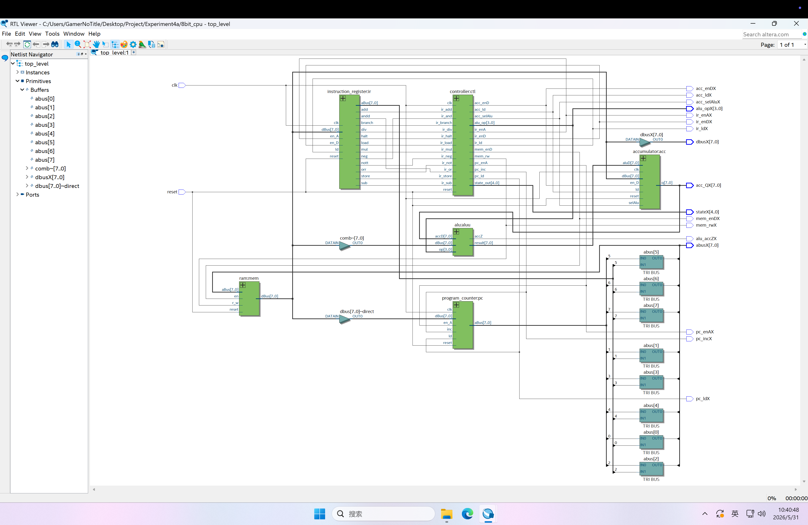

## 实验结果分析

### RAM 中测试程序说明

| 序号 | 指令字            | 汇编指令 | 说明                        |
| ---- | ----------------- | -------- | --------------------------- |
| 0    | ram(0) <=  x"14"; | STORE 4  | 把累加器acc的数据 0 存入 $4 |
| 1    | ram(1) <= x"30";  | SUB 0    | A = A – [$0]                |
| 2    | ram(2) <= x"25";  | ADD 5    | A = A + [$5]                |
| 3    | ram(3) <= x"15";  | STORE 5  | 累加器 acc 的数据存入 $5    |
| 4    | ram(4) <= x"46";  | MUL 6    | A = A * [$6]                |
| 5    | ram(5) <= x"31";  | SUB 1    | A = A – [$1]                |
| 6    | ram(6) <= x"55";  | DIV 5    | A = A / [$5]                |
| 7    | ram(7) <=  x"06"; | LOAD 6   | 将 [$6] 加载到累加器 acc    |
| 8    | ram(8) <=  x"01"; | LOAD 1   | 将 [$1] 加载到累加器 acc    |

### 测试分析

#### 测试程序分析

| 序号 |     指令字      | 汇编指令 |             说明             |
| :--: | :-------------: | :------: | :--------------------------: |
|  0   | ram(0) <= x"06" |  LOAD 6  | 从 [$6] 加载数据到累加器 ACC |
|  1   | ram(1) <= x"27" |  ADD 7   |       ACC = ACC + [$7]       |
|  2   | ram(2) <= x"38" |  SUB 8   |       ACC = ACC - [$8]       |
|  3   | ram(3) <= x"15" | STORE 5  |  将累加器 ACC 的数据存入 $5  |
|  4   | ram(4) <= x"A1" |   HALT   |             停机             |
|  5   | ram(5) <= x"00" |    -     |          数据空填充          |
|  6   | ram(6) <= x"18" |    -     |         预存数据 24          |
|  7   | ram(7) <= x"2B" |    -     |         预存数据 43          |
|  8   | ram(8) <= x"21" |    -     |         预存数据 33          |

#### 程序分析

对波形图的 reset 输入在开头置 1 以重置整个 CPU 的仿真状态，运行仿真，得到波形图如下

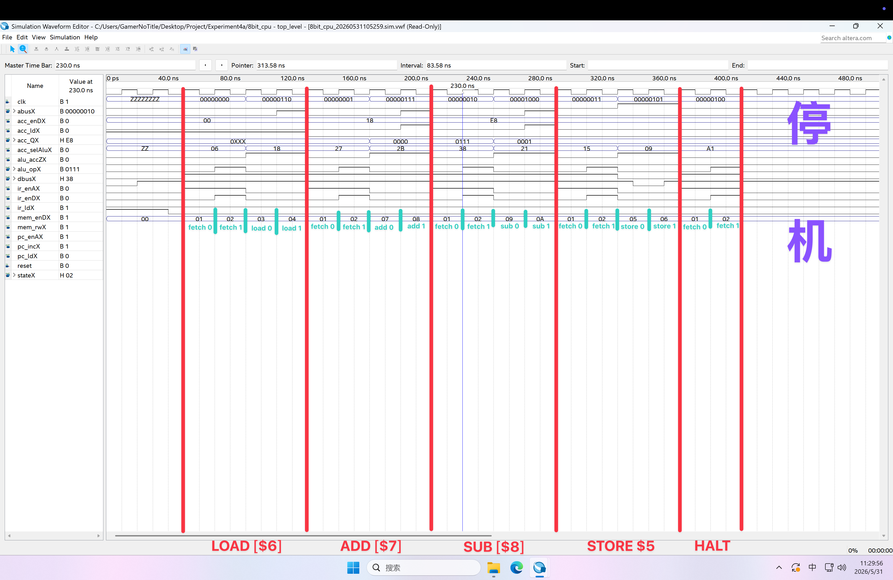

#### 数据运算过程分析

1. PC = 0，读取指令 LOAD 6（06）
   把存储单元 RAM 中地址为 6 的存储单元的数据加载到累加器 ACC 中，此时 ACC 里面的数据变成了 24/0x18
2. PC = 1，读取指令 ADD 7（27）
   存储单元 RAM 中地址为 7 的数据与累加器 ACC 中的数据共同作为 ALU 的输入，交由 ALU 进行加法运算，其结果输出给了 ACC，此时结果为 67/0x43
3. PC = 2，读取指令 SUB 8（38）
   存储单元 RAM 中地址为 8 的数据与累加器 ACC 中的数据共同作为 ALU 的输入，交由 ALU 进行减法运算，且此时的 ACC 输入为被减数，来自 RAM 的输入为减数，输出的差值输出回 ACC，此时 ACC 的数值为 34/0x22
4. PC = 3，读取指令 STORE 5（15）
   累加器 ACC 的数据被写入存储单元中，且此时的位置是地址 5 对应的存储单元
5. PC = 4，读取指令 HALT（A1）
   获取到停机指令，程序进行停机，不再继续执行

#### 指令周期分析

##### 1. PC = 0, LOAD 6

| 数据通路                  | 微操作序列                       | 说明                                     |
| ------------------------- | -------------------------------- | ---------------------------------------- |
| **fetch0 (50ns - 70ns)**  |                                  |                                          |
| ① (PC) -> abus            | pc_enA <= '1'                    | 让程序计数器 PC 使能                     |
| ② ram(abus) -> dbus       | mem_enD <= '1', mem_rw <= '1'    | 让存储器 mem 使能，并进入读取模式        |
| **fetch1 (70ns - 90ns)**  |                                  |                                          |
| ③ (dbus) -> irReg         | ir_ld <= '1'                     | 让指令寄存器进入置位操作                 |
| ④ (PC) + 1 -> PC          | pc_inc <= '1'                    | 程序计数器 PC 自增                       |
| **load0 (90ns - 110ns)**  |                                  |                                          |
| ⑤ (irReg(3..0)) -> abus   | ir_enA <= '1'                    | 让指令寄存器 IR 使能                     |
| ⑥ ram(abus) -> dbus       | mem_enD <= '1', mem_rw <= '1'    | 让存储器 mem 使能，并进入读取模式        |
| **load1 (110ns - 130ns)** |                                  |                                          |
| ⑦ (dbus) -> accReg        | acc_ld <= '1', acc_selAlu <= '0' | 让累加器加载数据，ALU 接受数据总线的数据 |

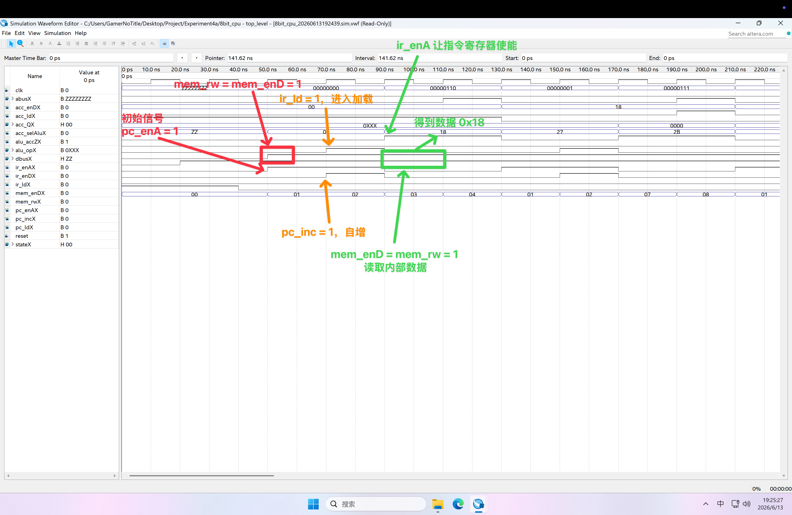

* ① `pc_enA <= '1' WHEN state = fetch0 OR state = fetch1 ELSE '0';` *controller.vhd (Line 122)*
  `aBus <= pcReg WHEN en_A = '1' ELSE "ZZZZZZZZ";` *program_counter.vhd (Line 27)*

* ② `mem_enD <= '1' WHEN state = fetch0 OR state = fetch1 OR ... ELSE '0';` *controller.vhd (Line 113-120)*
  `IF state = store0 THEN mem_rw <= '0'; ELSE mem_rw <= '1'; END IF;` *controller.vhd (Line 88-96)*
  `dBus <= ram(conv_integer(unsigned(aBus))) WHEN reset = '0' AND en = '1' AND r_w = '1' ELSE "ZZZZZZZZ";` *ram.vhd (Line 33-35)*

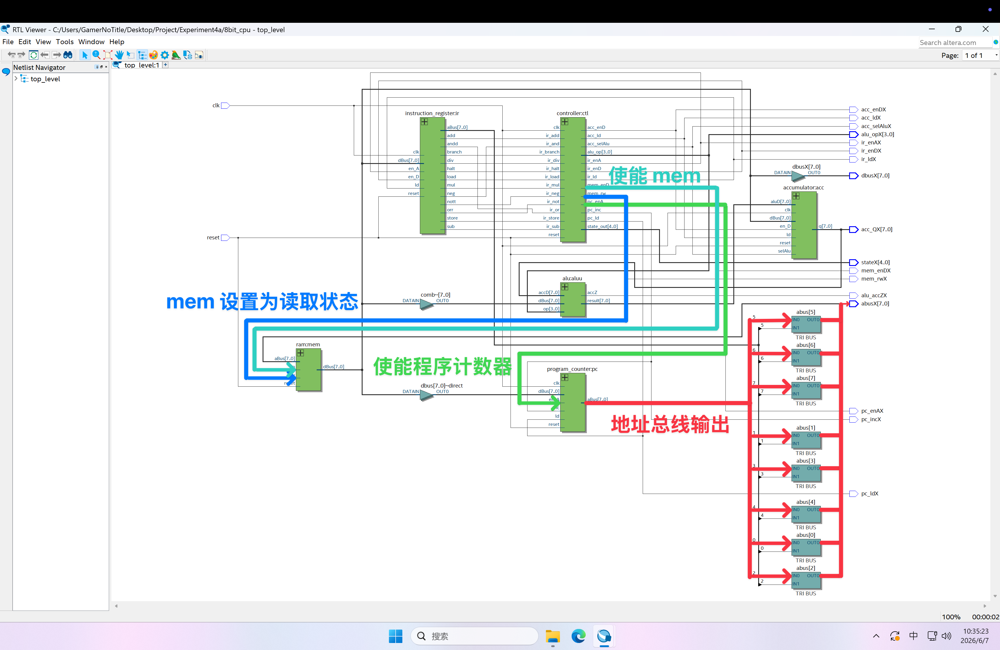

* ③ `ir_ld <= '1' WHEN state = fetch1 ELSE '0';` *controller.vhd (Line 135)*
  `irReg <= dBus;` *instruction_register.vhd (Line 20)*

* ④ `pc_inc <= '1' WHEN state = fetch1 ELSE '0';` *controller.vhd (Line 124)*
  `pcReg <= pcReg + "00000001";` *program_counter.vhd (Line 22)*

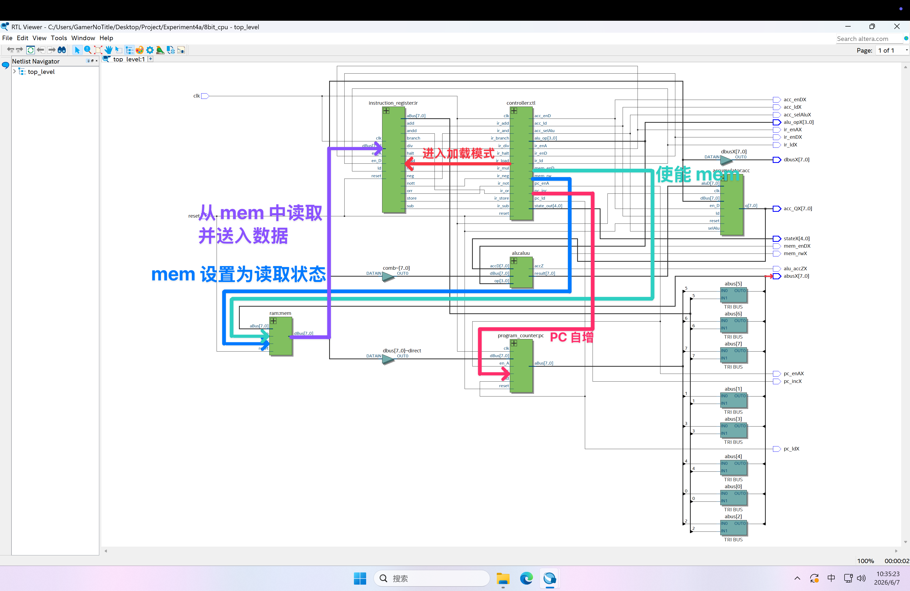

* ⑤ `ir_enA <= '1' WHEN state = load0 OR state = load1 OR ... ELSE '0';` *controller.vhd (Line 126-133)*
  `aBus <= "0000" & irReg(3 DOWNTO 0) WHEN en_A = '1' ELSE "ZZZZZZZZ";` *instruction_register.vhd (Line 25-26)*

* ⑥ `mem_enD <= '1' WHEN state = load0 OR state = load1 OR ... ELSE '0';` *controller.vhd (Line 113-120)*
  `dBus <= ram(conv_integer(unsigned(aBus))) WHEN reset = '0' AND en = '1' AND r_w = '1' ELSE "ZZZZZZZZ";` *ram.vhd (Line 33-35)*

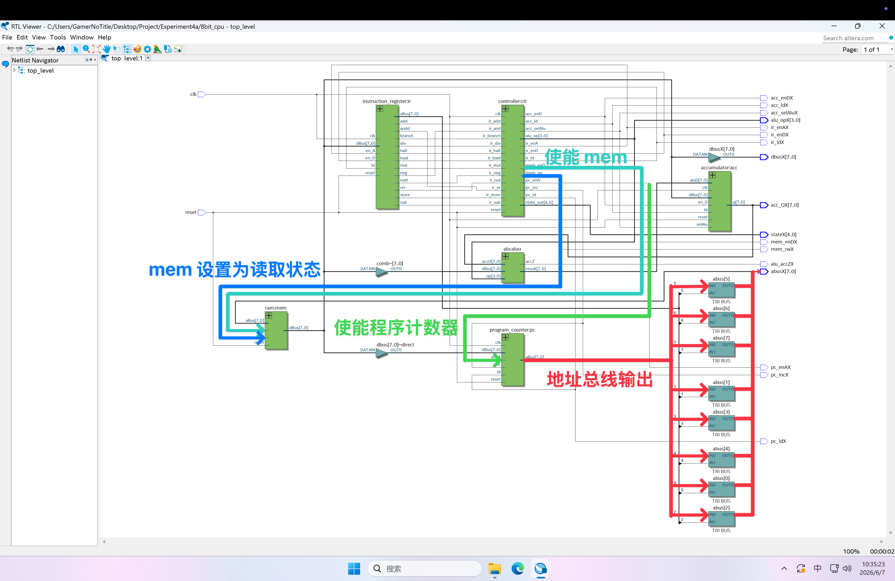

* ⑦ `acc_ld <= '1' WHEN state = load1 OR ... ELSE '0';` *controller.vhd (Line 138-140)*
  `acc_selAlu <= '1' WHEN ... ELSE '0';` *controller.vhd (Line 142-144)*
  `accReg <= dBus;` *accumulator.vhd (Line 23)*

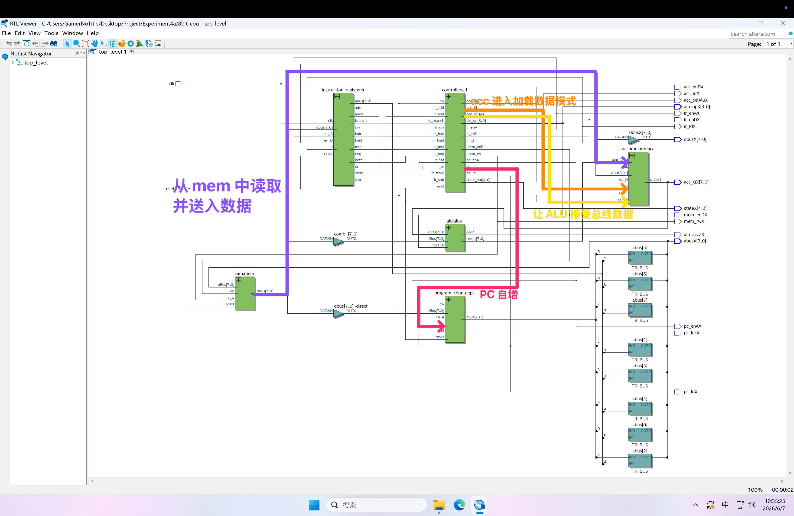


##### 2. PC = 1, ADD 7

| 数据通路                   | 微操作序列                       | 说明                                     |
| -------------------------- | -------------------------------- | ---------------------------------------- |
| **fetch0 (130ns - 150ns)** |                                  |                                          |
| ① (PC) -> abus             | pc_enA <= '1'                    | 让程序计数器 PC 使能                     |
| ② ram(abus) -> dbus        | mem_enD <= '1', mem_rw <= '1'    | 让存储器 mem 使能，并进入读取模式        |
| **fetch1 (150ns - 170ns)** |                                  |                                          |
| ③ (dbus) -> irReg          | ir_ld <= '1'                     | 让指令寄存器 IR 进入置位操作             |
| ④ (PC) + 1 -> PC           | pc_inc <= '1'                    | 程序计数器 PC 自增                       |
| **add0 (170ns - 190ns)**   |                                  |                                          |
| ⑤ (irReg(3..0)) -> abus    | ir_enA <= '1'                    | 让指令寄存器 IR 使能                     |
| ⑥ ram(abus) -> dbus        | mem_enD <= '1', mem_rw <= '1'    | 让存储器 mem 使能，并进入读取模式        |
| **add1 (190ns - 210ns)**   |                                  |                                          |
| ⑦ (dbus) + (acc) -> alu    | alu_op <= "0001"                 | 送入 ALU 操作类型 0001 = ADD             |
| ⑧ (alu_result) -> acc      | acc_ld <= '1', acc_selAlu <= '1' | 让累加器加载数据，ALU 接受数据总线的数据 |

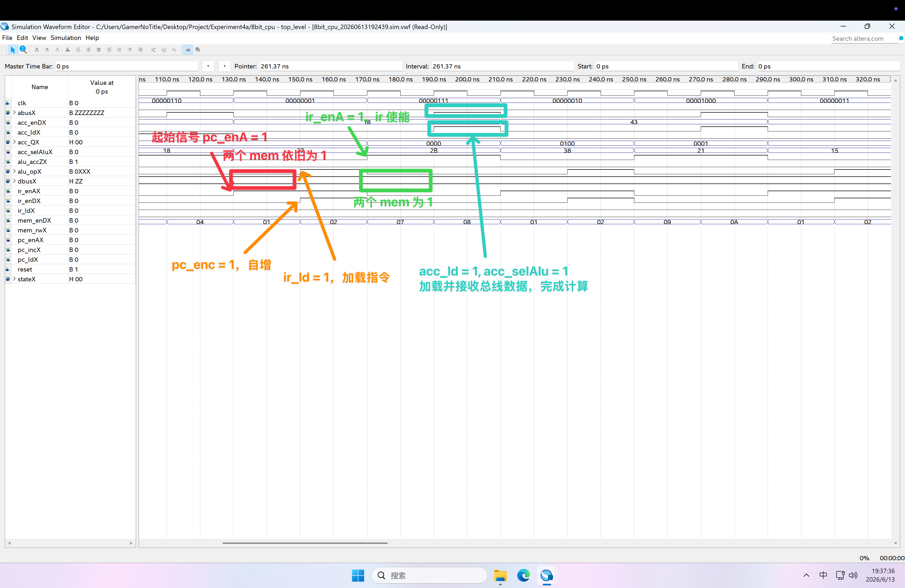

* ① `pc_enA <= '1' WHEN state = fetch0 OR state = fetch1 ELSE '0';` *controller.vhd (Line 122)*
  `aBus <= pcReg WHEN en_A = '1' ELSE "ZZZZZZZZ";` *program_counter.vhd (Line 27)*

* ② `mem_enD <= '1' WHEN state = fetch0 OR state = fetch1 OR ... ELSE '0';` *controller.vhd (Line 113-120)*
  `IF state = store0 THEN mem_rw <= '0'; ELSE mem_rw <= '1'; END IF;` *controller.vhd (Line 88-96)*
  `dBus <= ram(conv_integer(unsigned(aBus))) WHEN reset = '0' AND en = '1' AND r_w = '1' ELSE "ZZZZZZZZ";` *ram.vhd (Line 33-35)*


* ③ `ir_ld <= '1' WHEN state = fetch1 ELSE '0';` *controller.vhd (Line 135)*
  `irReg <= dBus;` *instruction_register.vhd (Line 20)*

* ④ `pc_inc <= '1' WHEN state = fetch1 ELSE '0';` *controller.vhd (Line 124)*
  `pcReg <= pcReg + "00000001";` *program_counter.vhd (Line 22)*


* ⑤ `ir_enA <= '1' WHEN state = add0 OR state = add1 OR ... ELSE '0';` *controller.vhd (Line 126-133)*
  `aBus <= "0000" & irReg(3 DOWNTO 0) WHEN en_A = '1' ELSE "ZZZZZZZZ";` *instruction_register.vhd (Line 25-26)*

* ⑥ `mem_enD <= '1' WHEN state = add0 OR state = add1 OR ... ELSE '0';` *controller.vhd (Line 113-120)*
  `dBus <= ram(conv_integer(unsigned(aBus))) WHEN reset = '0' AND en = '1' AND r_w = '1' ELSE "ZZZZZZZZ";` *ram.vhd (Line 33-35)*


* ⑦ `alu_op <= "0000" WHEN state = add0 OR state = add1 ELSE ...;` *controller.vhd (Line 146)*
  `result <= accD + dBus;` *alu.vhd (Line 22)*

* ⑧ `acc_ld <= '1' WHEN ... OR state = add1 OR ... ELSE '0';` *controller.vhd (Line 138-140)*
  `acc_selAlu <= '1' WHEN state = add1 OR ... ELSE '0';` *controller.vhd (Line 142-144)*
  `accReg <= aluD;` *accumulator.vhd (Line 21)*

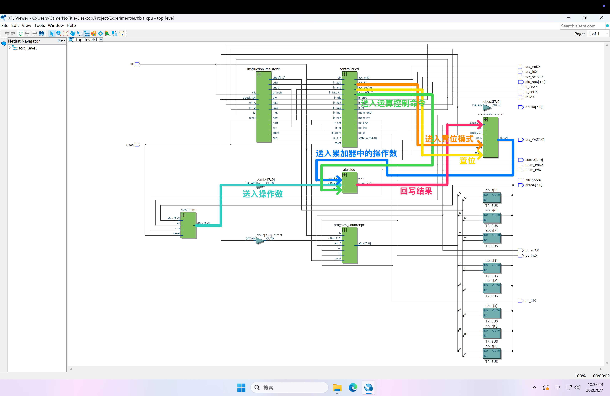


##### 3. PC = 2, SUB 8

| 数据通路                   | 微操作序列                       | 说明                                     |
| -------------------------- | -------------------------------- | ---------------------------------------- |
| **fetch0 (210ns - 230ns)** |                                  |                                          |
| ① (PC) -> abus             | pc_enA <= '1'                    | 让程序计数器 PC 使能                     |
| ② ram(abus) -> dbus        | mem_enD <= '1', mem_rw <= '1'    | 让存储器 mem 使能，并进入读取模式        |
| **fetch1 (230ns - 250ns)** |                                  |                                          |
| ③ (dbus) -> irReg          | ir_ld <= '1'                     | 让指令寄存器 IR 进入置位操作             |
| ④ (PC) + 1 -> PC           | pc_inc <= '1'                    | 程序计数器 PC 自增                       |
| **sub0 (250ns - 270ns)**   |                                  |                                          |
| ⑤ (irReg(3..0)) -> abus    | ir_enA <= '1'                    | 让指令寄存器 IR 使能                     |
| ⑥ ram(abus) -> dbus        | mem_enD <= '1', mem_rw <= '1'    | 让存储器 mem 使能，并进入读取模式        |
| **sub1 (270ns - 290ns)**   |                                  |                                          |
| ⑦ (acc) - (dbus) -> alu    | alu_op <= "0010"                 | 送入 ALU 操作类型 0010 = SUB             |
| ⑧ (alu_result) -> acc      | acc_ld <= '1', acc_selAlu <= '1' | 让累加器加载数据，ALU 接受数据总线的数据 |

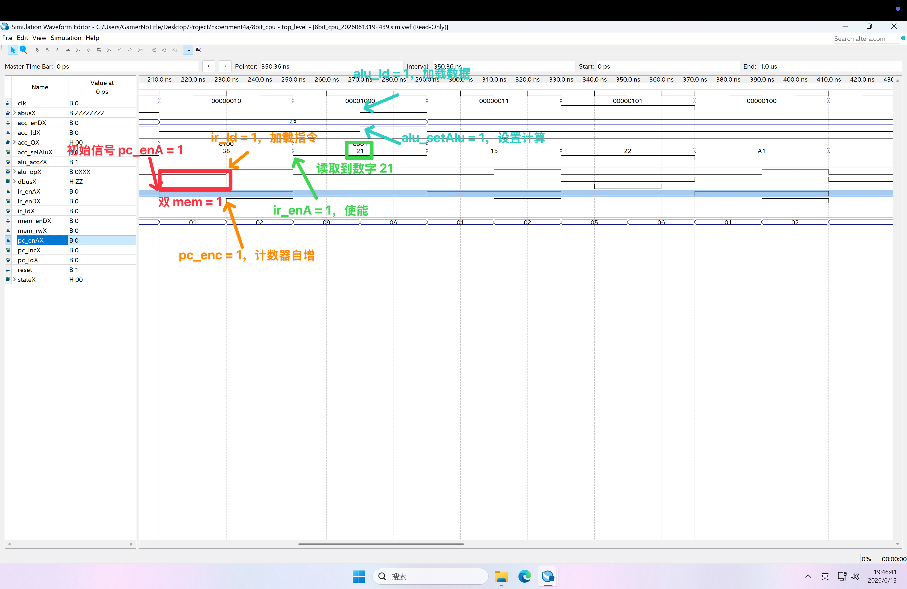

* ① `pc_enA <= '1' WHEN state = fetch0 OR state = fetch1 ELSE '0';` *controller.vhd (Line 122)*
  `aBus <= pcReg WHEN en_A = '1' ELSE "ZZZZZZZZ";` *program_counter.vhd (Line 27)*

* ② `mem_enD <= '1' WHEN state = fetch0 OR state = fetch1 OR ... ELSE '0';` *controller.vhd (Line 113-120)*
  `IF state = store0 THEN mem_rw <= '0'; ELSE mem_rw <= '1'; END IF;` *controller.vhd (Line 88-96)*
  `dBus <= ram(conv_integer(unsigned(aBus))) WHEN reset = '0' AND en = '1' AND r_w = '1' ELSE "ZZZZZZZZ";` *ram.vhd (Line 33-35)*


* ③ `ir_ld <= '1' WHEN state = fetch1 ELSE '0';` *controller.vhd (Line 135)*
  `irReg <= dBus;` *instruction_register.vhd (Line 20)*

* ④ `pc_inc <= '1' WHEN state = fetch1 ELSE '0';` *controller.vhd (Line 124)*
  `pcReg <= pcReg + "00000001";` *program_counter.vhd (Line 22)*


* ⑤ `ir_enA <= '1' WHEN state = sub0 OR state = sub1 OR ... ELSE '0';` *controller.vhd (Line 126-133)*
  `aBus <= "0000" & irReg(3 DOWNTO 0) WHEN en_A = '1' ELSE "ZZZZZZZZ";` *instruction_register.vhd (Line 25-26)*

* ⑥ `mem_enD <= '1' WHEN state = sub0 OR state = sub1 OR ... ELSE '0';` *controller.vhd (Line 113-120)*
  `dBus <= ram(conv_integer(unsigned(aBus))) WHEN reset = '0' AND en = '1' AND r_w = '1' ELSE "ZZZZZZZZ";` *ram.vhd (Line 33-35)*


* ⑦ `alu_op <= "0001" WHEN state = sub0 OR state = sub1 ELSE ...;` *controller.vhd (Line 147)*
  `result <= accD - dBus;` *alu.vhd (Line 30)*

* ⑧ `acc_ld <= '1' WHEN ... OR state = sub1 OR ... ELSE '0';` *controller.vhd (Line 138-140)*
  `acc_selAlu <= '1' WHEN ... OR state = sub1 OR ... ELSE '0';` *controller.vhd (Line 142-144)*
  `accReg <= aluD;` *accumulator.vhd (Line 21)*


##### 4. PC = 3, STORE 5

| 数据通路                   | 微操作序列                    | 说明                                       |
| -------------------------- | ----------------------------- | ------------------------------------------ |
| **fetch0 (290ns - 310ns)** |                               |                                            |
| ① (PC) -> abus             | pc_enA <= '1'                 | 让程序计数器 PC 使能                       |
| ② ram(abus) -> dbus        | mem_enD <= '1', mem_rw <= '1' | 让存储器 mem 使能，并进入读取模式          |
| **fetch1 (310ns - 330ns)** |                               |                                            |
| ③ (dbus) -> irReg          | ir_ld <= '1'                  | 让指令寄存器 IR 进入置位操作               |
| ④ (PC) + 1 -> PC           | pc_inc <= '1'                 | 程序计数器 PC 自增                         |
| **store0 (330ns - 350ns)** |                               |                                            |
| ⑤ (irReg(3..0)) -> abus    | ir_enA <= '1'                 | 让指令寄存器 IR 使能                     |
| ⑥ (acc) -> dbus            | acc_enD <= '1'                | 让累加器 ACC 使能                          |
| ⑦ dbus -> ram(abus)        | mem_rw <= '0'                 | 让存储器进入读写模式并写入来自累加器的数据 |
| **store1 (350ns - 370ns)** |                               |                                            |
| ⑧ dbus -> ram(abus)        | mem_rw <= '1'                 | 存储器进入读取模式                         |

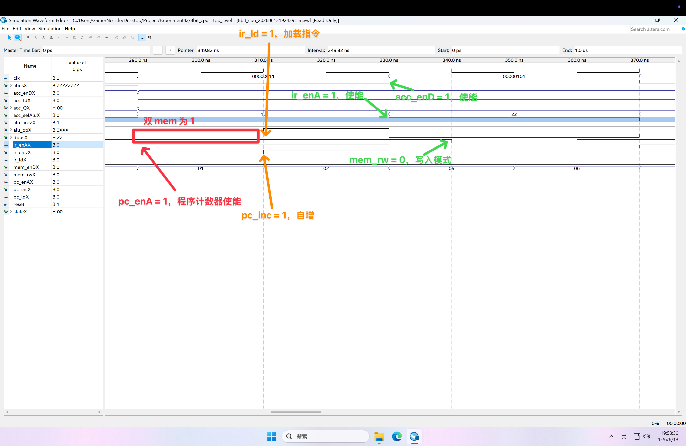

* ① `pc_enA <= '1' WHEN state = fetch0 OR state = fetch1 ELSE '0';` *controller.vhd (Line 122)*
  `aBus <= pcReg WHEN en_A = '1' ELSE "ZZZZZZZZ";` *program_counter.vhd (Line 27)*

* ② `mem_enD <= '1' WHEN state = fetch0 OR state = fetch1 OR ... ELSE '0';` *controller.vhd (Line 113-120)*
  `IF state = store0 THEN mem_rw <= '0'; ELSE mem_rw <= '1'; END IF;` *controller.vhd (Line 88-96)*
  `dBus <= ram(conv_integer(unsigned(aBus))) WHEN reset = '0' AND en = '1' AND r_w = '1' ELSE "ZZZZZZZZ";` *ram.vhd (Line 33-35)*


* ③ `ir_ld <= '1' WHEN state = fetch1 ELSE '0';` *controller.vhd (Line 135)*
  `irReg <= dBus;` *instruction_register.vhd (Line 20)*

* ④ `pc_inc <= '1' WHEN state = fetch1 ELSE '0';` *controller.vhd (Line 124)*
  `pcReg <= pcReg + "00000001";` *program_counter.vhd (Line 22)*


* ⑤ `ir_enA <= '1' WHEN state = store0 OR state = store1 OR ... ELSE '0';` *controller.vhd (Line 126-133)*
  `aBus <= "0000" & irReg(3 DOWNTO 0) WHEN en_A = '1' ELSE "ZZZZZZZZ";` *instruction_register.vhd (Line 25-26)*

* ⑥ `acc_enD <= '1' WHEN state = store0 OR state = store1 ELSE '0';` *controller.vhd (Line 137)*
  `dBus <= accReg WHEN en_D = '1' ELSE "ZZZZZZZZ";` *accumulator.vhd (Line 28)*

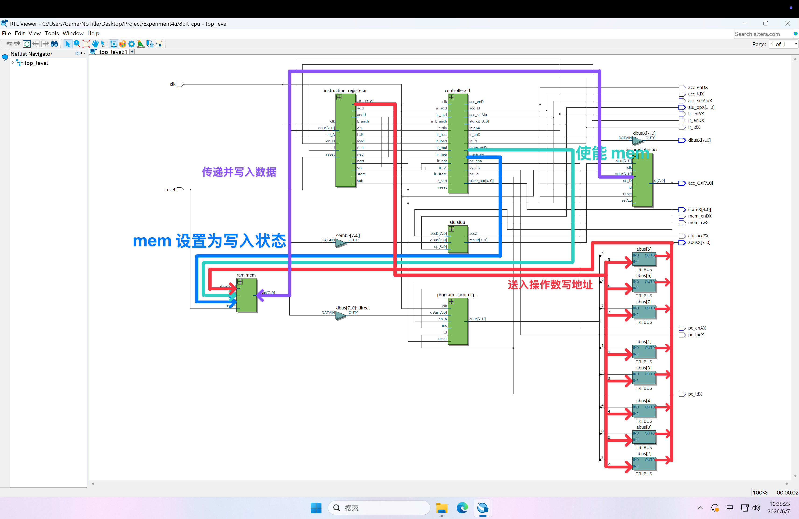

* ⑦ `IF state = store0 THEN mem_rw <= '0'; ELSE mem_rw <= '1'; END IF;` *controller.vhd (Line 88-96)*
  `ram(conv_integer(unsigned(aBus))) <= dBus;` *ram.vhd (Line 29)*

* ⑧ `mem_rw <= '1';` *controller.vhd (Line 92-93)*
  `dBus <= "ZZZZZZZZ";` *ram.vhd (Line 34-35)*

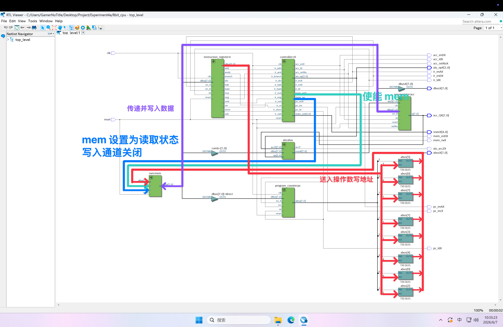


##### 5. PC = 4, HALT

| 数据通路                   | 微操作序列                    | 说明                              |
| -------------------------- | ----------------------------- | --------------------------------- |
| **fetch0 (370ns - 390ns)** |                               |                                   |
| ① (PC) -> abus             | pc_enA <= '1'                 | 让程序计数器 PC 使能              |
| ② ram(abus) -> dbus        | mem_enD <= '1', mem_rw <= '1' | 让存储器 mem 使能，并进入读取模式 |
| **fetch1 (390ns - 410ns)** |                               |                                   |
| ③ (dbus) -> irReg          | ir_ld <= '1'                  | 让指令寄存器 IR 进入置位操作      |
| ④ (PC) + 1 -> PC           | pc_inc <= '1'                 | 程序计数器 PC 自增                |
| **halt (410ns 之后)**      |                               |                                   |
| ⑤ state_out <= "01111"     |                               | 设置状态输出为 0x1111（HALT）     |

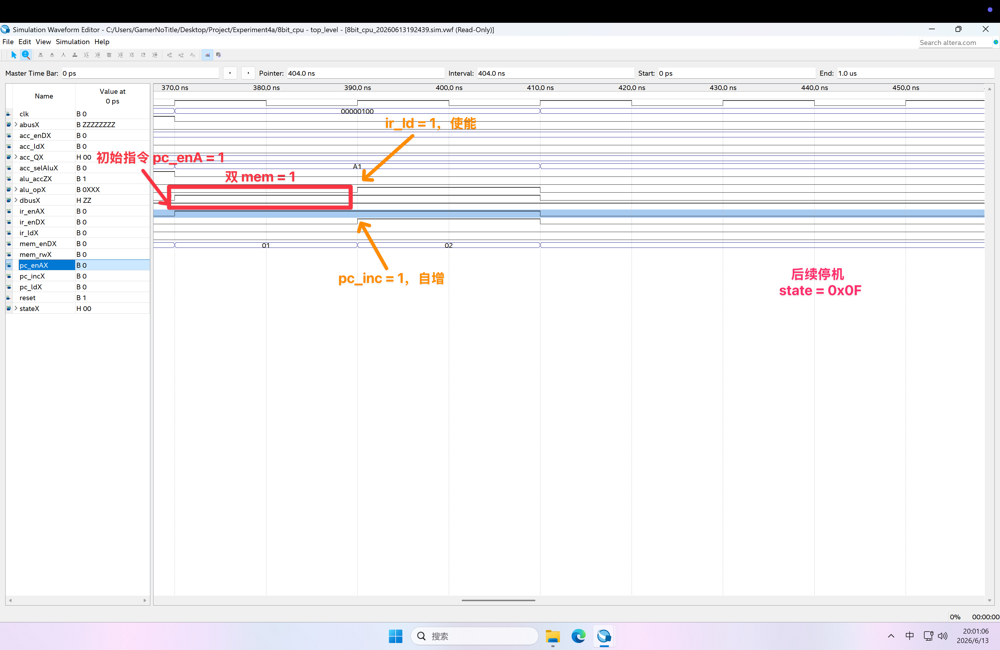

* ① `pc_enA <= '1' WHEN state = fetch0 OR state = fetch1 ELSE '0';` *controller.vhd (Line 122)*
  `aBus <= pcReg WHEN en_A = '1' ELSE "ZZZZZZZZ";` *program_counter.vhd (Line 27)*

* ② `mem_enD <= '1' WHEN state = fetch0 OR state = fetch1 OR ... ELSE '0';` *controller.vhd (Line 113-120)*
  `IF state = store0 THEN mem_rw <= '0'; ELSE mem_rw <= '1'; END IF;` *controller.vhd (Line 88-96)*
  `dBus <= ram(conv_integer(unsigned(aBus))) WHEN reset = '0' AND en = '1' AND r_w = '1' ELSE "ZZZZZZZZ";` *ram.vhd (Line 33-35)*


* ③ `ir_ld <= '1' WHEN state = fetch1 ELSE '0';` *controller.vhd (Line 135)*
  `irReg <= dBus;` *instruction_register.vhd (Line 20)*

* ④ `pc_inc <= '1' WHEN state = fetch1 ELSE '0';` *controller.vhd (Line 124)*
  `pcReg <= pcReg + "00000001";` *program_counter.vhd (Line 22)*


* ⑤ `state_out <= "01111" WHEN state = halt ELSE ...` *controller.vhd (Line 110)*

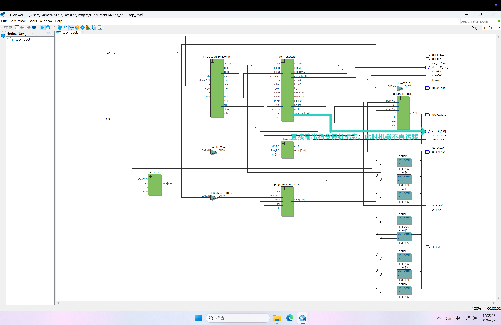


## 收获和体会

通过本次的 8 位硬布线 CPU 设计，让我又一次捡起来了 EDA 的有限状态机的相关知识。在阅读文档并修改相关代码的过程中，程序其实出现了很多的问题，包括 MUL 可能会导致位数翻倍、传入的指令位数与实际需求不匹配时的修复等等。因为我为了能够更直观地看到有限状态机的状态，于是又自己拉了一条 stateX 的输出便于观察（上面图片的最后一行）。又因为这里的 VHDL 跟 EDA 用的 Verilog 有些许不同，所以在这过程中又花费了一些时间。总之就是很麻烦。

不过在这个 Quartus 的情境下，倒是每个部件可以单独作为一个实例初始化，再用一个顶层设计把它们串起来，这一块还是比较的方便的。此外，因为这次说白了指令是集成在 RAM 里面的，所以说跑仿真测试的时候，实际上只用拉一段 Reset = 1 来重置状态即可，后面就是自己读取 RAM 的指令和操作数进行操作的部分了，比前面三个实验简单了不少（在拉测试数据的方面上）。

要说设计上够完美吗，我觉得并不，毕竟我也不是专业搞这个的，说实话，搞清楚各个部件之间的运作方式，真的就得靠上计组课听的那部分内容了，稍微看一下代码的逻辑，再跟上课学的那部分串起来，也能够懂得具体实际上在干些啥。