# 8位微程序CPU设计

## 目的

本项目的目的是设计一个简单的CPU（中央处理器）。这个CPU有基本的指令集，我们将利用它的指令集生成一个非常简单的程序来验证它的性能。为简单起见，我们将只考虑CPU、寄存器、内存和指令集之间的关系。也就是说，我们只需要考虑以下几项：读/写寄存器、读/写存储器和执行指令。

一个简单的CPU至少由四个部分构成：控制单元、内部寄存器、ALU和指令集，这些是我们项目设计的主要方面，将进行研究。

## 指令集

在我们的简单CPU设计中使用单地址指令格式。指令字包含两个部分：操作码（opcode），其定义指令的功能（加法、减法、逻辑运算等）; 地址部分，在大多数指令中，地址部分包含要操作的数据的存储位置，我们称之为直接寻址。在某些指令中，地址部分是操作数，称为立即寻址。

为简单起见，计算机内存的大小为256 × 16。指令字有16位。操作码部分有8位，地址部分有8位。指令字格式可表示为下表

| 操作码  [15...0] | 地址  [7...0] |
| :--------------: | :-----------: |

在表1中，符号[x]表示存储器中位置x的内容。例如，指令字00000011101110012（03 B 916）意味着CPU将存储器中位置B 9 16处的字加到累加器（ACC）中;指令字00000101000001112（050716）表示如果ACC（ACC [15]）的符号位为0，则CPU将该指令的地址部分作为下一条指令的地址，如果符号位为1，则CPU将程序计数器（PC）加1，并将其内容作为下一条指令的地址。

相关指令的操作码列于下表

| **INSTRUCTION** | **OPCODE** | **COMMENTS**                           |
| --------------- | ---------- | -------------------------------------- |
| **STORE  X**    | 01H        | ACC→[X]                                |
| **LOAD X**      | 02H        | [X]→ACC                                |
| **ADD  X**      | 03H        | ACC+[X]→ACC                            |
| **SUB X**       | 04H        | ACC-[X]→ACC                            |
| **JMPGZ  X**    | 05H        | IF ACC>0 THEN  X→PC ELSE PC+1→PC       |
| **AND X**       | 06H        | ACC and [X]→ACC                        |
| **OR  X**       | 07H        | ACC or [X]→ACC                         |
| **NOT X**       | 08H        | Not [X]→ACC                            |
| **SHIFTR  X**   | 09H        | SHIFL ACC to RIGHT 1 bit, Logic  Shift |
| **SHIFTL X**    | 0AH        | SHIFT  ACC to LEFT 1 bit, Logic Shift  |
| **MPY  X**      | 0BH        | ACC×[X]→ACC                            |
| **HALT**        | 0CH        | HALT  A PROGRAM                        |

## 内部寄存器和存储器介绍

MAR（存储器地址寄存器）：MAR包含要从存储器读取或写入存储器的字的存储器位置。这里，READ操作表示CPU从存储器读取，WRITE操作表示CPU向存储器写入。在我们的设计中，MAR有8位来访问存储器的256个地址中的一个。

MBR（存储器缓冲寄存器）：MBR包含要存储在存储器中的值或从存储器中读取的最后一个值。MBR连接到系统总线的地址线。在我们的设计中，MBR有16位。

PC（程序计数器）：PC跟踪程序中要使用的指令。

IR（指令寄存器）：IR包含指令的操作码部分。在我们的设计中，IR有8位。

BR（缓冲寄存器）：BR被用作ALU的输入，它容纳ALU的其他操作数。在我们的设计中，BR有16位。

LPM_RAM_DQ：LPM_RAM_DQ是一个具有独立输入和输出端口的RAM。它作为一个存储器工作，其大小为256×16。尽管它不是CPU的内部寄存器，但我们需要它来模拟和测试CPU的性能。

LPM_ROM只读存储器：LPM_ROM是一个具有一个地址输入端口和一个数据输出端口的ROM，其数据大小为32位，包含执行微操作的控制信号。

ALU（算术逻辑单元）：ALU是完成基本算术和逻辑运算的计算单元。在我们的设计中，必须支持如下所列的一些操作：

| **ALU control signal** | **Operations** | **Explanations**              |
| ---------------------- | -------------- | ----------------------------- |
| 3H                     | ADD            | ACC←ACC+BR                    |
| 4H                     | SUB            | ACC←ACC-  BR                  |
| 6H                     | AND            | ACC←ACC  and BR               |
| 7H                     | OR             | ACC←ACC  or BR                |
| 8H                     | NOT            | ACC←not ACC                   |
| 9H                     | SHIFTR         | ACC←Shift ACC  to Right 1 bit |
| 0AH                    | SHIFTL         | ACC←Shift ACC  to Left 1 bit  |

## 微程序控制单元

在微程序控制中，微程序由一些微指令组成，微程序被存储在控制存储器中，该存储器产生正确执行指令集所需的所有控制信号。微指令包含一些同时执行的微操作。

下图显示了这种执行方式的关键因素。

微指令集被存储在控制存储器中。控制地址寄存器包含了要读取的下一个微指令的地址。当一个微指令从控制存储器中读出时，它被转移到控制缓冲寄存器中。该寄存器连接到从控制单元发出的控制线。因此，从控制存储器中读取一个微指令与执行该微指令是一样的。图中所示的第三个元素是一个排序单元，它加载控制地址寄存器并发出一个读指令。

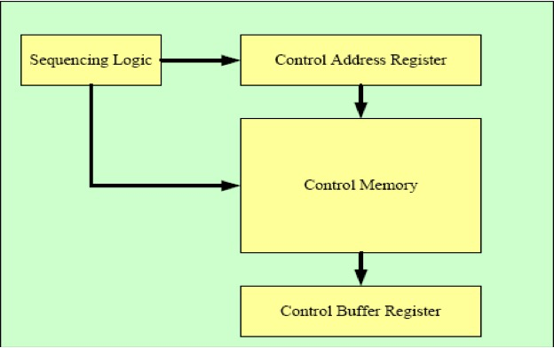

### 指令总控制信号

| Bits  in Control Memory | Micro-operation | Meaning                      |
| ----------------------- | --------------- | ---------------------------- |
| C0~C7                   | /               | Branch Addresses             |
| C8                      | PC←0            | Clear  PC                    |
| C9                      | PC←PC+1         | Increment  PC                |
| C10                     | PC←MBR[7..0]    | MBR[7..0]  to PC             |
| C11                     | ACC←0           | Clear ACC                    |
| C12--C15                | ALU  CONTROL    | Control  operations of ALU   |
| C16                     | R               | Read data from Memory to MBR |
| C17                     | W               | Write data to Memory         |
| C18                     | MAR←MBR[7..0]   | MBR[7..0]  to MAR as address |
| C19                     | MAR←PC          | PC  value to MAR             |
| C20                     | MBR←ACC         | ACC  value to MBR            |
| C21                     | IR←MBR[15..8]   | MBR[15..8]  to IR as opcode  |
| C22                     | BR←MBR          | Copy  MBR to BR              |
| C23                     | CAR←CAR+1       | Increment CAR                |
| C24                     | CAR←C0~C7       | C7~C0 to CAR                 |
| C25                     | CAR←OPCODE+CAR  | Add OP to CAR                |
| C26                     | CAR←0           | Reset CAR                    |
| C27--C31                | Not  use        | -----------                  |

### rom.mif中的内容和相应的微程序

```
0	:	00810000;        R←1,         CAR←CAR+1
	1	:	00A00000;       OP←MBR[15..8],CAR←CAR+1
	2	:	02000000;       CAR←CAR+OP
	3	:	01000014;       CAR←14H
	4	:	01000019;       CAR←19H
	5	:	0100001E;       CAR←1EH
	6	:	01000023;       CAR←23H
	7	:	01000041;       CAR←41H
	8	:	01000028;       CAR←28H
	9	:	0100002D;       CAR←2DH
	a	:	01000032;       CAR←32H
	b	:	01000037;       CAR←37H
	c	:	0100003C;       CAR←3CH
	d	:	01000046;       CAR←46H
	e	:	0100004B;       CAR←4H
	f	:	00000000;
   …       ……
	14	:	00840000;    MAR←MBR[7..0], CAR←CAR+1     ------STORE
	15	:	00920200;    MBR←ACC, PC←PC+1,W←1,CAR←CAR+1
	16	:	04080000;    CAR←0
	17	:	00000000;
	18	:	00000000;
	19	:	00840000;    MAR←MBR[7..0], CAR←CAR+1      ------LOAD
	1a	:	00810A00;    PC←PC+1,R←1,ACC←0,CAR←CAR+1
	1b	:	00C03000;    BR←MBR,ACC←ACC+BR, CAR←CAR+1
	1c	:	04080000;    CAR←0
	1d	:	00000000;
	1e	:	00840000;    MAR←MBR[7..0], CAR←CAR+1  ----------ADD
	1f	:	00810200;    PC←PC+1,R←1,CAR←CAR+1
	20	:	00C03000;    BR←MBR,ACC←ACC+BR, CAR←CAR+1
	21	:	04080000;    CAR←0
	22	:	00000000;
	23	:	00840000;    MAR←MBR[7..0], CAR←CAR+1  ----------SUB
	24	:	00810200;    PC←PC+1,R←1,CAR←CAR+1
	25	:	00C04000;    BR←MBR,ACC←ACC-BR, CAR←CAR+1
	26	:	04080000;    CAR←0
	27	:	00000000;
	28	:	00840000;    MAR←MBR[7..0], CAR←CAR+1   ---------AND
	29	:	00810200;    PC←PC+1,R←1,CAR←CAR+1
	2a	:	00C06000;    BR←MBR,ACC←ACC AND BR,CAR←CAR+1
	2b	:	04080000;     CAR←0
	2c	:	00000000;
	2d	:	00840000;     MAR←MBR[7..0], CAR←CAR+1  ---------OR
	2e	:	00810200;     PC←PC+1,R←1,CAR←CAR+1
	2f	:	00C07000;     BR←MBR,ACC←ACC OR BR, CAR←CAR+1
	30	:	04080000;     CAR←0
	31	:	00000000;
	32	:	00840000;     MAR←MBR[7..0], CAR←CAR+1  ----------NOT
	33	:	00808200;     PC←PC+1, ACC←NOT ACC,CAR←CAR+1
	34	:	04080000;     CAR←0
	35	:	00000000;
	36	:	00000000;
	37	:	00840000;     MAR←MBR[7..0], CAR←CAR+1  ----------SHIFTR
	38	:	08092000;     PC←PC+1, ACC←SHIFT ACC to Right 1 bit,CAR←CAR+1
	39	:	04080000;     CAR←0
	3a	:	00000000;
	3b	:	00000000;
	3c	:	00840000;    MAR←MBR[7..0], CAR←CAR+1  -----------SHIFTL
	3d	:	0080A200;    PC←PC+1, ACC←SHIFT ACC to Left 1 bit,CAR←CAR+1
	3e	:	04080000;    CAR←0
	3f	:	00000000;
	40	:	00000000;
	41	:	00840000;    MAR←MBR[7..0], CAR←CAR+1  -----------JMPGEZ
	42	:	00805000;    CAR←CAR+1,
	43	:	04080000;    CAR←0
	44	:	00000000;
	45	:	00000000;
	46	:	00840000;    MAR←MBR[7..0], CAR←CAR+1  ------------MPY
	47	:	00810200;    PC←PC+1,R←1,CAR←CAR+1
	48	:	00C0B000;   BR←MBR,ACC←ACC*BR, CAR←CAR+1
	49	:	04080000;    CAR←0
	4a	:	00000000;
	4b	:	0100004B;    CAR←4BH  ------------------------------HALT
	4c	:	00000000;
```

## CPU电路图

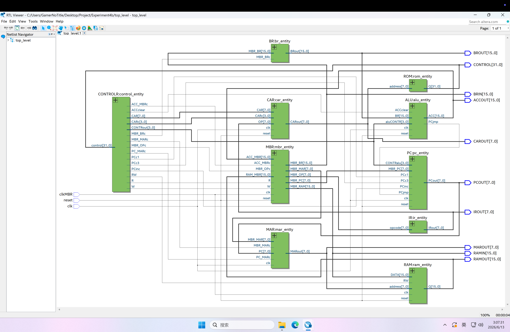

## 程序波形图与线路图具体分析

### 测试程序 1：计算自己学号后四位的前 2 + 后 2

#### 程序指令码

| 地址 | 指令码 | 指令  | 操作数 | 说明                                   |
| ---- | ------ | ----- | ------ | -------------------------------------- |
| 0x00 | 022A   | LOAD  | 2A     | 从地址 0x2A 加载加数                   |
| 0x01 | 032B   | ADD   | 2B     | 执行加法，加数为地址 0x2B 内存储的数字 |
| 0x02 | 012C   | STORE | 2C     | 将结果保存到地址 0x2C                  |
| 0x2A | 0C00   | HALT  | 00     | 停机                                   |
| 0x2A | 002B   | -     | 2B     | 存储数字 0x2B                          |
| 0x2B | 0021   | -     | 21     | 存储数字 0x21                          |

#### 波形图及指令分析

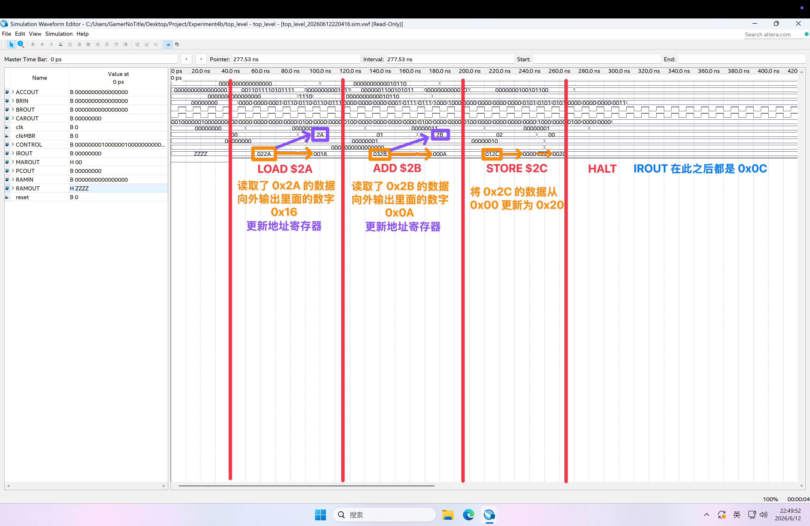

1. 已知 ROM 储存为对应的操作。则在初始时，`CAR `中的值为0。`CAR` 将该地址值送至 `ROM` 中。`ROM` 将对应地址的值返回至 `CONTRAL` 控制缓冲寄存器。由波形图可得ROM中的到的数据为 `00810000`。`CONTRAL` 在获取指令后将信号传递至 `MAR` 且将信号传至 `MBR` 中的 `R`，表示从`RAM` 中读取数据。当 `ROM` 中读取第一条指令后，`CAR` 执行 `CAR←CAR+1`

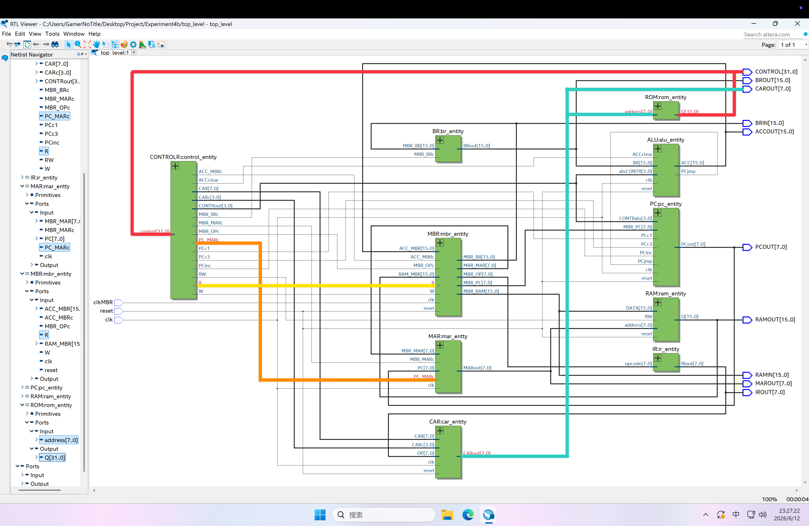

2. 初始时，`PC` 值为 `0`，`PC` 将指令地址通过地址总线传递给`MAR`。`MAR` 同时将这个从 `PC` 得到的地址送至 `RAM` 中读第一个指令数据

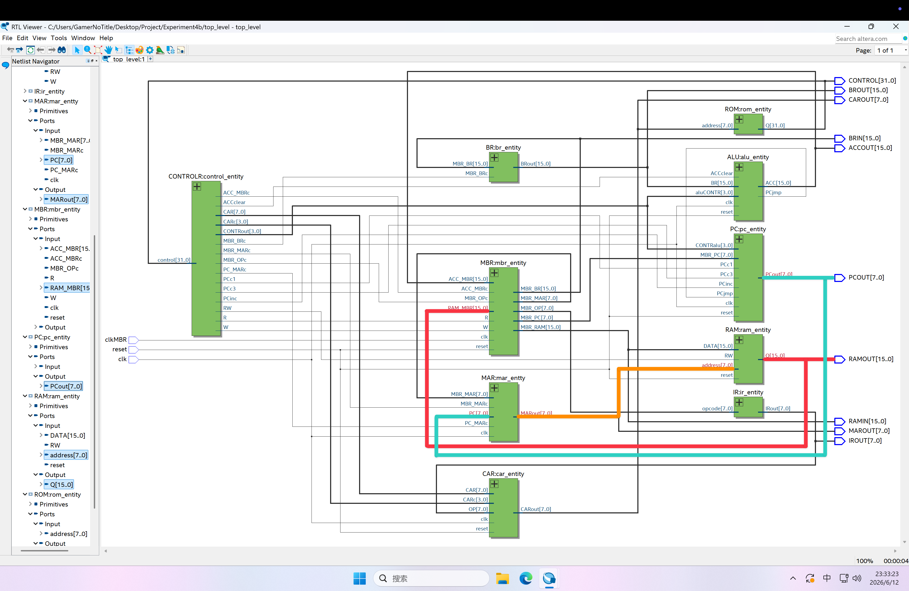

3. 与上述第一部分过程同理可得，该地址送到ROM中读取对应的指令。对与得到的第二条指令，则 `CONTRAL` 通过 `MBR_OPc` 向 `MBR` 发出信号。`MBR` 将此时的前 `8` 位作为操作数经过 `IR` 传至 `CAR`。当完成该条指令的读取后，`CAR` 执行 `CAR←CAR+1`


4. 当 `CAR` 的值为 `02` 时，`CONTRAL` 将 `0100` 通过 `CARc` 传至 `CAR` 。此时会执行 `CAR<=OP+CAR` 即 `CAR` 变为 `4`。此时 `ROM` 根据该地址寻找对应的指令

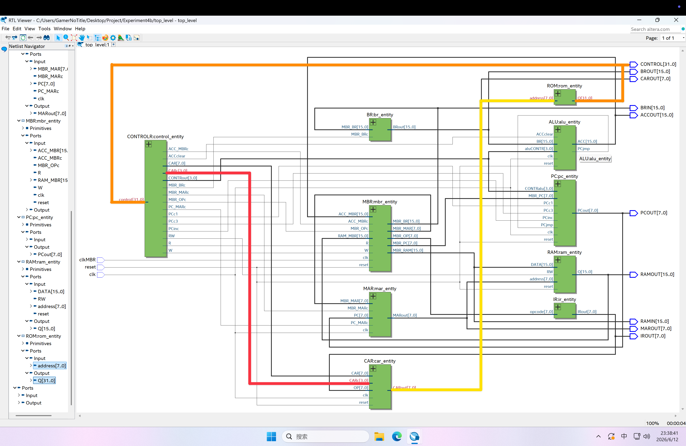

5. 此时 `CAR` 的值为 `04`，所以该 `CPU` 会执行 `CAR←19`，使得 `CAR` 的值变为 `19`。此时 `CAR` 中的值 `19` 传入到 `rom` 中找出对应的微指令， 并通过数据线将微指令传入到 `control` 中，至此正式进入 `LOAD` 操作。在 `RAM` 中读取到数据后，该数据将会被送至 `MBR`。由波形图可以得到，读取到第一个指令为 `0x022A`，此时 `MBR` 取后八位为地址（`0x2A`）。该地址由 `MBR` 送至 `MAR`，最后 `MAR` 根据由 `MBR` 得到的地址得到对应地址的 `RAM` 的数据

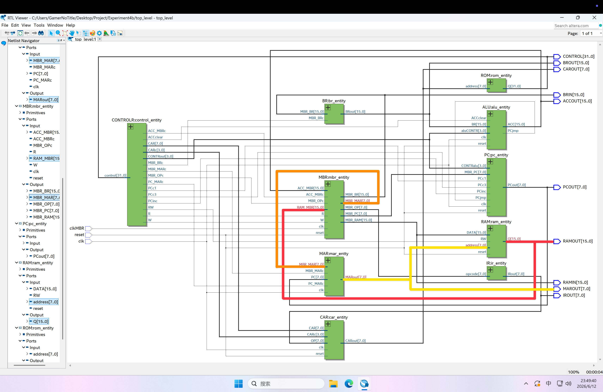

6. 当取得 `RAM` 中数据后，则该数据送至 `MBR`，`MBR` 得到 `CONTRAL` 得到的信号后将该数据经过 `BR` 送至 `ALU`。此时 `LOAD`指令结束

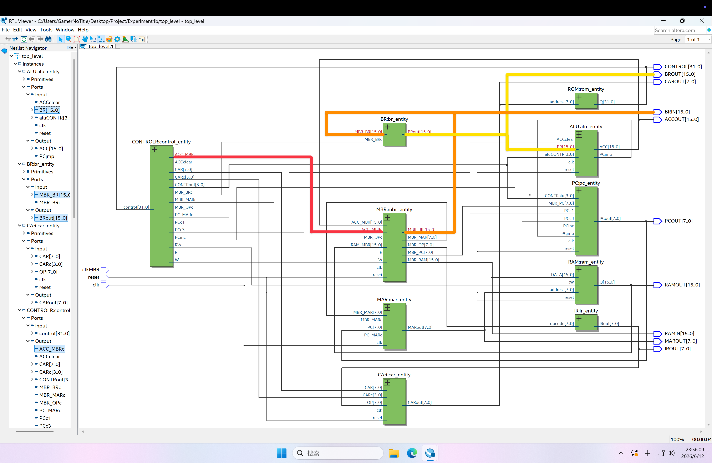

7. 当上述完成后，`PC` 中的值完成自加变为 `1`，`MAR` 中的值被清零。此时重复第二阶段过程从 `RAM` 中获取数据，得到 `032B`。同时重复上述第四部分过程，`CAR` 为 `02` 时 `CAR` 得到 `CAR=CAR+OP`。此时，对应的 `OP` 为 `3`，因此对应的 `ROM` 中地址为 `05`，随后跳转至 `1E` 进入 `ADD` 加法操作

8. 重复上述第五阶段，从 `RAM` 中读取位置 `2B` 对应的数据 `21`。该数据经过 `MBR` 送至 `BR` 最后送至 `ALU`。同时，操作码由对应的在 `ROM` 中的内容直接送至 `ALU`。`ALU` 在接受到加法信号后，将自身原本储存的值与 `RAM` 中得到的值进行相加

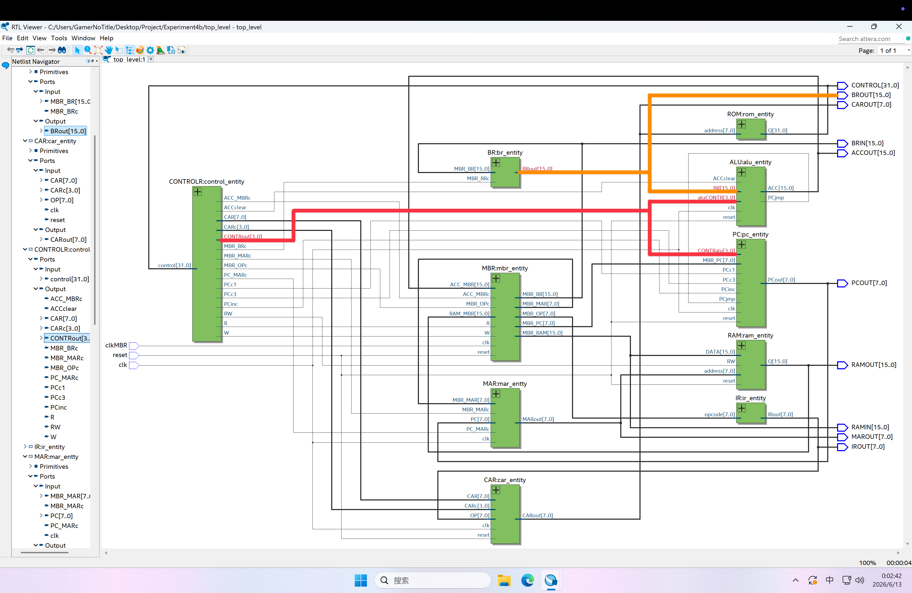

9. 当完成加法时，`CONTRAL` 向 `RAM` 与 `MBR` 发送写入的信号。该结果在送至 `MBR` 后再储存只由 `MAR` 中提供的地址对应的地方。至此，程序结束运行

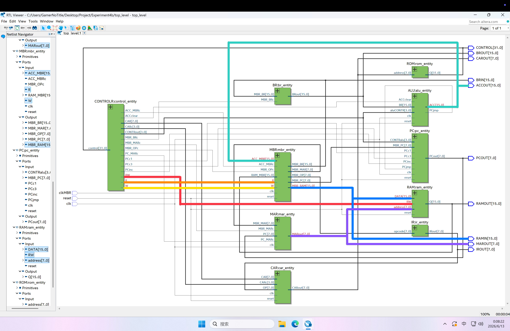

### 测试程序 2：从 1 到 100 求和

#### 程序指令码

| 地址 | 指令码 | 指令  | 操作数    |
| ---- | ------ | ----- | --------- |
| 0x00 | 02A0   | LOAD  | A0        |
| 0x01 | 01A4   | STORE | A4        |
| 0x02 | 02A2   | LOAD  | A2        |
| 0x03 | 01A3   | STORE | A3        |
| 0x04 | 02A4   | LOAD  | A4        |
| 0x05 | 03A3   | ADD   | A3        |
| 0x06 | 01A4   | STORE | A4        |
| 0x07 | 02A3   | LOAD  | A3        |
| 0x08 | 04A1   | SUB   | A1        |
| 0x09 | 01A3   | STORE | A3        |
| 0x0A | 0504   | JMPGZ | 04 (LOOP) |
| 0x0B | 0C00   | HALT  | 00        |
| 0xA0 | 0000   | -     | -         |
| 0xA1 | 0001   | -     | -         |
| 0xA2 | 0064   | -     | -         |

#### 波形图及指令分析

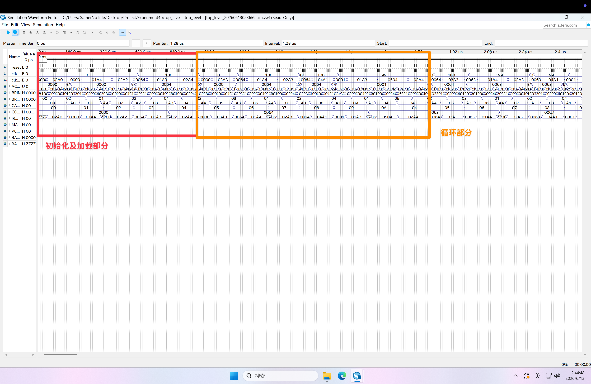

将波形图划分为两个部分，其中第一部分为准备阶段，第二部分为循环阶段；

第一阶段：将 `100` 存入 `RAM` 中地址 `0xA4` 处，用于循环次数的控制；将 `0` 存入 `RAM` 的地址处，用于存放相加的结果。

第二阶段、数据的循环：其中 `RAM` 的 `0xA4`处与 `0xA3` 中储存的值进行相加；`0xA3` 中的值循环减一。当 `0xA3` 中的值为 `0` 时跳出循环。

1. 起初时，`CAR`、`MBR` 与 `PC` 均重置为 `0`。当从 `ROM` 中读取第一条指令时，`R` 为 `1` 传递至 `MBR`，从而对 `RAM` 进行读取。此时为将 `0xA0` 处的数据读出。在读取完成后，根据 `RAM` 中第二条指令提供的地址，将其放入 `MAR`。再根据操作码将该数据储存至 `MAR` 对应地址处
2. 同理，对 `RAM` 中 `A2` 处数据进行读取，随后储存至对应的地址
3. 初始进入循环体的时候 `CAR` 为 `1`。然后会将 `CAR` 中的值 `1` 传入到ROM中找出对应的微指令，并通过数据线将微指令传入到 `CONTRAL` 中。`CONTRAL` 根据数据将 `R` 信号传入 `MBR`，同时 `CAR←CAR+1`
4. 此时 `PC` 为 `5`。此时 `PC` 将该地址传入 `MAR`，随后根据该地址读取 `RAM`。该出指令为 `0x03A3`，操作码 `0x03` 表示加法运算，`0xA3` 表示加数所在的位置。`CAR` 的值为 `2`，然后会将 `CAR`中的值 `2` 传入到 `ROM` 中找出对应的微指令，将微指令传入到 `CONTRAL`，所以 `CPU` 会执行 `CAR←CAR+OP` 操作，使得 `CAR` 的值变为 `05`。随后 `CAR` 根据 `ROM` 此处对应的操作码跳转至 `0x1E` 处，进入加法阶段。
5. `CAR` 的值 +1；此时 `CAR` 的值为 `0x1F`。然后会将 `CAR` 中的值 `0x1F` 传入到ROM中找出对应的微指令，并通过数据线将微指令传入到 `CONTRAL` 中。此时 `CPU` 会执行 `PC+1` 的操作，并且将读信号 `R` 置为 `1`，最后将 `CAR` 的值 `+1` 变为 `20`
6. `CAR` 为 `20` 的时候，`CAR` 将其传入到 `ROM` 中找出对应的微指令，并通过数据线将微指令传入到 `CONTRAL` 中。该 CPU 会将 `MBR` 中的从 `0xA3` 处得到的数据 `0x0064` 通过数据总线传入到 `BR`。然后 `ACC` 中的值和 `BR` 中的值相加并存回 `ACC`，相加后的结果为`0x0064`。最后会将 `CAR` 与 `PC` 的值 +1，此时整个 `ADD` 操作执行完毕
7. `CAR` 为 `21` 的时候，`CAR` 将其传入到 `ROM` 中找出对应的微指令。该指令将 `CAR` 给予置零。此时 `PC` 为 `6`。此时 `PC` 将该地址传入 `MAR`，随后根据该地址读取 `RAM` 得到 `0x01A4`。随后该加法结果将会被储存在 `RAM` 的 `0x04` 地址处
8. `CAR` 被置零后，但 `PC` 为 `7`。根据 `PC` 提供的地址将对应的内容取出，得到 `0x02A3`。随后将 `0xA3` 地址处对应的内容取出并存放至 `MBR` 并且 `PC+1`。操作完成后，`CAR` 被置零
9. 与上述过程同理，`CAR` 由 `00` 到 `01` 到 `02`。随后根据 `RAM` 中操作码 `04` 进行 `CAR←CAR+OP` 操作而变为 `0x06`。随后再次跳至 `0x23`。此时进入了减法阶段
10. 在减法阶段，相关操作与上述加法阶段同理。区别为 `CONTRAL` 传递给 `ALU` 的信号变为了 `SUB`。再减法完成后，该数据存放 `0xA3`
11. 在完成一次循环后，`ALU` 中的值为 `RAM` 中 `0xA3` 完成减法后的值。该值大于 `0` 的时候 `PC` 变为 `04` 进行第二次循环；当该值小于等于 `0` 的时候便可退出循环。
12. 在程序的结尾处可看到 `0xA4` 中最终储存的值为 `5050`。而且随后在 `0xA3` 中的值减法运行结束后退出循环程序结束。

## 附录

```verilog
--ALU

LIBRARY ieee;
USE ieee.std_logic_1164.ALL;
USE ieee.std_logic_unsigned.ALL;
USE ieee.NUMERIC_STD.ALL;
ENTITY ALU IS
   PORT (
      clk, reset, ACCclear : IN STD_LOGIC;
      aluCONTR : IN STD_LOGIC_VECTOR(3 DOWNTO 0);--控制命令
      BR : IN STD_LOGIC_VECTOR(15 DOWNTO 0);--缓冲寄存器输入
      PCjmp : OUT STD_LOGIC;
      ACC : BUFFER STD_LOGIC_VECTOR(15 DOWNTO 0)); --buffer 可以输出，可以内部读取，但是不能从外部输入
END ALU;
ARCHITECTURE behave OF ALU IS
BEGIN
   PROCESS (clk)
   BEGIN
      IF (clk'event AND clk = '0') THEN
         IF reset = '0' THEN
            ACC <= x"0000"; --重置ACC
         ELSE
            IF ACCclear = '1' THEN
               ACC <= x"0000";
            END IF; --重置ACC
            IF aluCONTR = "0011" THEN
               ACC <= BR + ACC;
            END IF; --ADD
            IF aluCONTR = "0100" THEN
               ACC <= ACC - BR;
            END IF; --SUB
            IF aluCONTR = "0110" THEN
               ACC <= ACC AND BR;
            END IF; --AND
            IF aluCONTR = "0111" THEN
               ACC <= ACC OR BR;
            END IF; --OR
            IF aluCONTR = "1000" THEN
               ACC <= NOT ACC;
            END IF; --NOT
            IF aluCONTR = "1001" THEN --SRR 右移
               ACC(14 DOWNTO 0) <= ACC(15 DOWNTO 1);
               ACC(15) <= '0';
            END IF;
            IF aluCONTR = "1010" THEN --SRL 左移
               ACC(15 DOWNTO 1) <= ACC(14 DOWNTO 0);
               ACC(0) <= '0';
            END IF;
            IF aluCONTR = "1011" THEN
               ACC <= STD_LOGIC_VECTOR(to_unsigned((to_integer(unsigned(ACC)) * to_integer(unsigned(BR))), 16));
            END IF; --MPY乘
         END IF;
      END IF;
      IF ACC > 0 THEN
         PCjmp <= '1'; --转移
      ELSE
         PCjmp <= '0';
      END IF;
   END PROCESS;
END behave;
```

```verilog
--流寄存器
LIBRARY ieee;
USE ieee.std_logic_1164.ALL;

ENTITY BR IS
     PORT (
          MBR_BRc : IN STD_LOGIC;--输入信号
          MBR_BR : IN STD_LOGIC_VECTOR(15 DOWNTO 0);
          BRout : OUT STD_LOGIC_VECTOR(15 DOWNTO 0));
END BR;
ARCHITECTURE behave OF BR IS
BEGIN
     PROCESS (MBR_BRc)
     BEGIN
          IF MBR_BRc = '1' THEN
               BRout <= MBR_BR;
          END IF;
     END PROCESS;
END behave;
```

```verilog

--控制地址寄存器
LIBRARY ieee;
USE ieee.std_logic_1164.ALL;
USE ieee.std_logic_unsigned.ALL;
ENTITY CAR IS
  PORT (
    clk, reset : IN STD_LOGIC;
    CARc : IN STD_LOGIC_VECTOR(3 DOWNTO 0);
    CAR, OP : IN STD_LOGIC_VECTOR(7 DOWNTO 0);
    CARout : BUFFER STD_LOGIC_VECTOR(7 DOWNTO 0));
END CAR;
ARCHITECTURE behave OF CAR IS
BEGIN
  PROCESS (clk)
  BEGIN
    IF (clk'event AND clk = '1') THEN
      IF reset = '1' THEN
        IF CARc = "1000" THEN
          CARout <= "00000000";
        END IF;--CAR清零
        IF CARc = "0100" THEN
          CARout <= OP + CARout;
        END IF;--CAR+某个数
        IF CARc = "0010" THEN
          CARout <= CAR;
        END IF;--从外界输入CAR
        IF CARc = "0001" THEN
          CARout <= CARout + 1;
        END IF;--CAR自增
      ELSE
        CARout <= "00000000";
      END IF;
    END IF;
  END PROCESS;
END behave;
```

```verilog

--微程序控制器
LIBRARY ieee;
USE ieee.std_logic_1164.ALL;
USE ieee.std_logic_unsigned.ALL;
ENTITY CONTROLR IS
     PORT (
          control : IN STD_LOGIC_VECTOR(31 DOWNTO 0);
          R, W, RW, PCc1, PCinc, PCc3 : OUT STD_LOGIC;
          ACCclear, MBR_MARc, PC_MARc : OUT STD_LOGIC;
          ACC_MBRc, MBR_OPc, MBR_BRc : OUT STD_LOGIC;
          CONTRout : OUT STD_LOGIC_VECTOR(3 DOWNTO 0);
          CARc : OUT STD_LOGIC_VECTOR(3 DOWNTO 0);
          CAR : OUT STD_LOGIC_VECTOR(7 DOWNTO 0));
END CONTROLR;
ARCHITECTURE behave OF CONTROLR IS
BEGIN
     PROCESS (control)
     BEGIN --分解32位Control输入
          CAR <= control(7 DOWNTO 0);
          PCc1 <= control(8);
          PCinc <= control(9);
          PCc3 <= control(10);
          ACCclear <= control(11);
          CONTRout <= control(15 DOWNTO 12);
          R <= control(16);
          W <= control(17);
          MBR_MARc <= control(18);
          PC_MARc <= control(19);
          ACC_MBRc <= control(20);
          MBR_OPc <= control(21);
          MBR_BRc <= control(22);
          CARc <= control(26 DOWNTO 23);
          RW <= control(17);
     END PROCESS;
END behave;
```

```verilog
--指令寄存器 用于暂存指令
LIBRARY ieee;
USE ieee.std_logic_1164.ALL;
USE ieee.std_logic_unsigned.ALL;
ENTITY IR IS
    PORT (
        opcode : IN STD_LOGIC_VECTOR(7 DOWNTO 0);
        IRout : OUT STD_LOGIC_VECTOR(7 DOWNTO 0));
END IR;
ARCHITECTURE behave OF IR IS
BEGIN
    IRout <= opcode;
END behave;
```

```verilog

--内存地址寄存器

LIBRARY ieee;
USE ieee.std_logic_1164.ALL;
USE ieee.std_logic_unsigned.ALL;
ENTITY MAR IS
  PORT (
    clk, PC_MARc, MBR_MARc : IN STD_LOGIC;
    PC, MBR_MAR : IN STD_LOGIC_VECTOR(7 DOWNTO 0);
    MARout : OUT STD_LOGIC_VECTOR(7 DOWNTO 0));
END MAR;
ARCHITECTURE behave OF MAR IS
BEGIN
  PROCESS (clk)
  BEGIN
    IF (clk'event AND clk = '1') THEN
      IF PC_MARc = '1' THEN
        MARout <= PC;
      END IF;--PC请求时输入PC
      IF MBR_MARc = '1' THEN
        MARout <= MBR_MAR;
      END IF;--MBR请求时输入MBR
    END IF;
  END PROCESS;
END behave;
```

```verilog
--内存流寄存器
LIBRARY ieee;
USE ieee.std_logic_1164.ALL;
USE ieee.std_logic_unsigned.ALL;
ENTITY MBR IS
  PORT (
    clk, reset, MBR_OPc, ACC_MBRc, R, W : IN STD_LOGIC;
    ACC_MBR : IN STD_LOGIC_VECTOR(15 DOWNTO 0);
    RAM_MBR : IN STD_LOGIC_VECTOR(15 DOWNTO 0);
    MBR_RAM : OUT STD_LOGIC_VECTOR(15 DOWNTO 0);
    MBR_BR : OUT STD_LOGIC_VECTOR(15 DOWNTO 0);
    MBR_OP : OUT STD_LOGIC_VECTOR(7 DOWNTO 0);
    MBR_MAR : OUT STD_LOGIC_VECTOR(7 DOWNTO 0);
    MBR_PC : OUT STD_LOGIC_VECTOR(7 DOWNTO 0));
END MBR;
ARCHITECTURE behave OF MBR IS
BEGIN
  PROCESS (clk)
    VARIABLE temp : STD_LOGIC_VECTOR(15 DOWNTO 0);
  BEGIN
    IF (clk'event AND clk = '0') THEN
      IF reset = '1' THEN--重置信号
        IF ACC_MBRc = '1' THEN
          temp := ACC_MBR;
        END IF;--ACC_MBR输入到变量
        IF R = '1' THEN
          MBR_BR <= RAM_MBR;
        END IF;--读
        IF W = '1' THEN
          MBR_RAM <= temp;
        END IF;--写
        MBR_MAR <= RAM_MBR(7 DOWNTO 0);
        MBR_PC <= RAM_MBR(7 DOWNTO 0);
        IF MBR_OPc = '1' THEN
          MBR_OP <= RAM_MBR(15 DOWNTO 8);
        END IF;
      ELSE
        MBR_BR <= x"0000";
        MBR_MAR <= "00000000";
        MBR_OP <= "00000000";
        MBR_PC <= "00000000";
      END IF;
    END IF;
  END PROCESS;
END behave;
```

```verilog
--程序计数器

LIBRARY ieee;
USE ieee.std_logic_1164.ALL;
USE ieee.std_logic_unsigned.ALL;
ENTITY PC IS
  PORT (
    clk, PCjmp, PCc1, PCinc, PCc3, reset : IN STD_LOGIC;--pcjmp 跳转信号，pcc1 清零信号，pcinc 自增信号，pcc3 MBR赋值信号
    CONTRalu : IN STD_LOGIC_VECTOR(3 DOWNTO 0);
    MBR_PC : IN STD_LOGIC_VECTOR(7 DOWNTO 0);
    PCout : BUFFER STD_LOGIC_VECTOR(7 DOWNTO 0));
END PC;
ARCHITECTURE behave OF PC IS
BEGIN
  PROCESS (clk)
  BEGIN
    IF (clk'event AND clk = '0') THEN
      IF reset = '1' THEN
        IF CONTRalu = "0101" THEN --跳转操作
          IF PCjmp = '1' THEN
            PCout <= MBR_PC;
          ELSIF PCjmp = '0' THEN
            PCout <= PCout + 1;
          END IF;
        END IF;
        IF PCc1 = '1' THEN
          PCout <= "00000000";
        END IF;
        IF PCinc = '1' THEN
          PCout <= PCout + 1;
        END IF;
        IF PCc3 = '1' THEN
          PCout <= MBR_PC;
        END IF;
      ELSE
        PCout <= "00000000";
      END IF;
    END IF;
  END PROCESS;
END behave;
```

```verilog
LIBRARY IEEE;
USE IEEE.std_logic_1164.ALL;
USE IEEE.std_logic_arith.ALL;
LIBRARY ALTERA_MF;
USE ALTERA_MF.ALTERA_MF_COMPONENTS.ALL;

ENTITY RAM IS
  PORT (
    clk : IN STD_LOGIC;
    DATA : IN STD_LOGIC_VECTOR(15 DOWNTO 0);
    address : IN STD_LOGIC_VECTOR(7 DOWNTO 0);
    RW : IN STD_LOGIC;
    reset : IN STD_LOGIC;
    Q : OUT STD_LOGIC_VECTOR(15 DOWNTO 0)
  );
END RAM;

ARCHITECTURE SYN OF ram IS
  SIGNAL ram_out : STD_LOGIC_VECTOR(15 DOWNTO 0);
  COMPONENT altsyncram
    GENERIC (
      intended_device_family : STRING;
      width_a : NATURAL;
      widthad_a : NATURAL;
      numwords_a : NATURAL;
      operation_mode : STRING;
      outdata_reg_a : STRING;
      init_file : STRING;
      lpm_type : STRING
    );
    PORT (
      wren_a : IN STD_LOGIC;
      clock0 : IN STD_LOGIC;
      address_a : IN STD_LOGIC_VECTOR(7 DOWNTO 0);
      data_a : IN STD_LOGIC_VECTOR(15 DOWNTO 0);
      q_a : OUT STD_LOGIC_VECTOR(15 DOWNTO 0)
    );
  END COMPONENT;
BEGIN
  altsyncram_component : altsyncram
  GENERIC MAP(
    intended_device_family => "Cyclone",
    width_a => 16,
    widthad_a => 8,
    numwords_a => 256,
    operation_mode => "SINGLE_PORT",
    outdata_reg_a => "UNREGISTERED",
    init_file => "ram2.mif",
    lpm_type => "altsyncram"
  )
  PORT MAP(
    wren_a => RW,
    clock0 => clk,
    address_a => address,
    data_a => DATA,
    q_a => ram_out
  );

  Q <= ram_out WHEN reset = '1' AND RW = '0' ELSE
    "ZZZZZZZZZZZZZZZZ";
END SYN;
```

```verilog
LIBRARY IEEE;
USE IEEE.std_logic_1164.ALL;
USE IEEE.std_logic_arith.ALL;
ENTITY ROM IS
	PORT (
		address : IN STD_LOGIC_VECTOR(7 DOWNTO 0);
		Q : OUT STD_LOGIC_VECTOR(31 DOWNTO 0)
	);
END ROM;
ARCHITECTURE romArch OF rom IS
	TYPE rom_typ IS ARRAY(0 TO 255) OF STD_LOGIC_VECTOR(31 DOWNTO 0);
	SIGNAL rom : rom_typ;
BEGIN

	rom(0) <= x"00810000";
	rom(1) <= x"00A00000";
	rom(2) <= x"02000000";
	rom(3) <= x"01000014";
	rom(4) <= x"01000019";
	rom(5) <= x"0100001E";
	rom(6) <= x"01000023";
	rom(7) <= x"01000041";
	rom(8) <= x"01000028";
	rom(9) <= x"0100002D";
	rom(10) <= x"01000032";
	rom(11) <= x"01000037";
	rom(12) <= x"0100004B";
	rom(13) <= x"01000046";
	rom(14) <= x"0100004B";
	rom(15) <= x"00000000";

	rom(20) <= x"00840000";
	rom(21) <= x"00920200";
	rom(22) <= x"04080000";
	rom(23) <= x"00000000";
	rom(24) <= x"00000000";
	rom(25) <= x"00840000";
	rom(26) <= x"00810A00";
	rom(27) <= x"00C03000";
	rom(28) <= x"04080000";
	rom(29) <= x"00000000";
	rom(30) <= x"00840000";
	rom(31) <= x"00810200";
	rom(32) <= x"00C03000";
	rom(33) <= x"04080000";
	rom(34) <= x"00000000";
	rom(35) <= x"00840000";

	rom(36) <= x"00810200";
	rom(37) <= x"00C04000";
	rom(38) <= x"04080000";
	rom(39) <= x"00000000";
	rom(40) <= x"00840000";
	rom(41) <= x"00810200";
	rom(42) <= x"00C06000";
	rom(43) <= x"04080000";
	rom(44) <= x"00000000";
	rom(45) <= x"00840000";
	rom(46) <= x"00810200";
	rom(47) <= x"00C07000";
	rom(48) <= x"04080000";
	rom(49) <= x"00000000";
	rom(50) <= x"00840000";

	rom(51) <= x"00808200";
	rom(52) <= x"04080000";
	rom(53) <= x"00000000";
	rom(54) <= x"00000000";
	rom(55) <= x"00840000";
	rom(56) <= x"08092000";
	rom(57) <= x"04080000";
	rom(58) <= x"00000000";
	rom(59) <= x"00000000";
	rom(60) <= x"00840000";
	rom(61) <= x"0080A200";
	rom(62) <= x"04080000";
	rom(63) <= x"00000000";
	rom(64) <= x"00000000";
	rom(65) <= x"00840000";

	rom(66) <= x"00805000";
	rom(67) <= x"04080000";
	rom(68) <= x"00000000";
	rom(69) <= x"00000000";
	rom(70) <= x"00840000";
	rom(71) <= x"00810200";
	rom(72) <= x"00C0B000";
	rom(73) <= x"04080000";
	rom(74) <= x"00000000";
	rom(75) <= x"0100004B";
	rom(76) <= x"00000000";

	PROCESS (address) BEGIN
		Q <= rom(conv_integer(unsigned(address)));
	END PROCESS;

END romArch;
```

```verilog
LIBRARY ieee;
USE ieee.std_logic_1164.ALL;
USE ieee.std_logic_unsigned.ALL;
ENTITY top_level IS
	PORT (
		clk, reset, clkMBR : IN STD_LOGIC;--
		ACCOUT : OUT STD_LOGIC_VECTOR(15 DOWNTO 0);--
		CONTROL : OUT STD_LOGIC_VECTOR(31 DOWNTO 0);--
		PCOUT : OUT STD_LOGIC_VECTOR(7 DOWNTO 0);--
		CAROUT : OUT STD_LOGIC_VECTOR(7 DOWNTO 0);--
		MAROUT : OUT STD_LOGIC_VECTOR(7 DOWNTO 0);--
		RAMIN : OUT STD_LOGIC_VECTOR(15 DOWNTO 0);--
		RAMOUT : OUT STD_LOGIC_VECTOR(15 DOWNTO 0);--
		IROUT : OUT STD_LOGIC_VECTOR(7 DOWNTO 0);--
		BRIN : OUT STD_LOGIC_VECTOR(15 DOWNTO 0);--
		BROUT : OUT STD_LOGIC_VECTOR(15 DOWNTO 0)--

	);
END top_level;

ARCHITECTURE topArch OF top_level IS
	COMPONENT MBR
		PORT (
			clk, reset, MBR_OPc, ACC_MBRc, R, W : IN STD_LOGIC;
			ACC_MBR : IN STD_LOGIC_VECTOR(15 DOWNTO 0);
			RAM_MBR : IN STD_LOGIC_VECTOR(15 DOWNTO 0);
			MBR_RAM : OUT STD_LOGIC_VECTOR(15 DOWNTO 0);
			MBR_BR : OUT STD_LOGIC_VECTOR(15 DOWNTO 0);
			MBR_OP : OUT STD_LOGIC_VECTOR(7 DOWNTO 0);
			MBR_MAR : OUT STD_LOGIC_VECTOR(7 DOWNTO 0);
			MBR_PC : OUT STD_LOGIC_VECTOR(7 DOWNTO 0)

		);
	END COMPONENT;

	COMPONENT BR
		PORT (
			MBR_BRc : IN STD_LOGIC;
			MBR_BR : IN STD_LOGIC_VECTOR(15 DOWNTO 0);
			BRout : OUT STD_LOGIC_VECTOR(15 DOWNTO 0)

		);
	END COMPONENT;

	COMPONENT MAR
		PORT (
			clk, PC_MARc, MBR_MARc : IN STD_LOGIC;
			PC, MBR_MAR : IN STD_LOGIC_VECTOR(7 DOWNTO 0);
			MARout : OUT STD_LOGIC_VECTOR(7 DOWNTO 0)
		);
	END COMPONENT;

	COMPONENT PC
		PORT (
			clk, PCjmp, PCc1, PCinc, PCc3, reset : IN STD_LOGIC;
			CONTRalu : IN STD_LOGIC_VECTOR(3 DOWNTO 0);
			MBR_PC : IN STD_LOGIC_VECTOR(7 DOWNTO 0);
			PCout : BUFFER STD_LOGIC_VECTOR(7 DOWNTO 0)

		);

	END COMPONENT;

	COMPONENT IR
		PORT (
			opcode : IN STD_LOGIC_VECTOR(7 DOWNTO 0);
			IRout : OUT STD_LOGIC_VECTOR(7 DOWNTO 0)

		);

	END COMPONENT;

	COMPONENT CAR
		PORT (
			clk, reset : IN STD_LOGIC;
			CARc : IN STD_LOGIC_VECTOR(3 DOWNTO 0);
			CAR, OP : IN STD_LOGIC_VECTOR(7 DOWNTO 0);
			CARout : BUFFER STD_LOGIC_VECTOR(7 DOWNTO 0)

		);

	END COMPONENT;

	COMPONENT CONTROLR
		PORT (
			control : IN STD_LOGIC_VECTOR(31 DOWNTO 0);
			R, W, RW, PCc1, PCinc, PCc3 : OUT STD_LOGIC;
			ACCclear, MBR_MARc, PC_MARc : OUT STD_LOGIC;
			ACC_MBRc, MBR_OPc, MBR_BRc : OUT STD_LOGIC;
			CONTRout : OUT STD_LOGIC_VECTOR(3 DOWNTO 0);
			CARc : OUT STD_LOGIC_VECTOR(3 DOWNTO 0);
			CAR : OUT STD_LOGIC_VECTOR(7 DOWNTO 0)

		);

	END COMPONENT;

	COMPONENT ALU
		PORT (
			clk, reset, ACCclear : IN STD_LOGIC;
			aluCONTR : IN STD_LOGIC_VECTOR(3 DOWNTO 0);
			BR : IN STD_LOGIC_VECTOR(15 DOWNTO 0);
			PCjmp : OUT STD_LOGIC;
			ACC : BUFFER STD_LOGIC_VECTOR(15 DOWNTO 0)
		);

	END COMPONENT;
	COMPONENT RAM
		PORT (
			clk : IN STD_LOGIC;
			DATA : IN STD_LOGIC_VECTOR(15 DOWNTO 0);
			address : IN STD_LOGIC_VECTOR(7 DOWNTO 0);
			RW : IN STD_LOGIC;
			reset : IN STD_LOGIC;
			Q : OUT STD_LOGIC_VECTOR(15 DOWNTO 0)
		);

	END COMPONENT;

	COMPONENT ROM
		PORT (
			address : IN STD_LOGIC_VECTOR(7 DOWNTO 0);
			Q : OUT STD_LOGIC_VECTOR(31 DOWNTO 0)
		);

	END COMPONENT;

	SIGNAL maro : STD_LOGIC_VECTOR(7 DOWNTO 0);
	SIGNAL romo : STD_LOGIC_VECTOR(31 DOWNTO 0);
	SIGNAL data : STD_LOGIC_VECTOR(15 DOWNTO 0);
	SIGNAL caro : STD_LOGIC_VECTOR(7 DOWNTO 0);
	SIGNAL rw : STD_LOGIC;
	SIGNAL ramo : STD_LOGIC_VECTOR(15 DOWNTO 0);
	SIGNAL accclear : STD_LOGIC;
	SIGNAL controut : STD_LOGIC_VECTOR(3 DOWNTO 0);
	SIGNAL bro : STD_LOGIC_VECTOR(15 DOWNTO 0);
	SIGNAL pcjmp : STD_LOGIC;
	SIGNAL acc : STD_LOGIC_VECTOR(15 DOWNTO 0);
	SIGNAL carc : STD_LOGIC_VECTOR(3 DOWNTO 0);
	SIGNAL cari : STD_LOGIC_VECTOR(7 DOWNTO 0);
	SIGNAL iro : STD_LOGIC_VECTOR(7 DOWNTO 0);

	SIGNAL pcc1 : STD_LOGIC;
	SIGNAL pcinc : STD_LOGIC;
	SIGNAL pcc3 : STD_LOGIC;

	SIGNAL pc_marc : STD_LOGIC;
	SIGNAL mbr_marc : STD_LOGIC;
	SIGNAL pco : STD_LOGIC_VECTOR(7 DOWNTO 0);

	SIGNAL mbr_brc : STD_LOGIC;
	SIGNAL mbr_opc : STD_LOGIC;
	SIGNAL acc_mbrc : STD_LOGIC;
	SIGNAL r, w : STD_LOGIC;
	SIGNAL mbr_br : STD_LOGIC_VECTOR(15 DOWNTO 0);
	SIGNAL opcode : STD_LOGIC_VECTOR(7 DOWNTO 0);
	SIGNAL mbr_mar : STD_LOGIC_VECTOR(7 DOWNTO 0);
	SIGNAL mbr_pc : STD_LOGIC_VECTOR(7 DOWNTO 0);
BEGIN

	mbr_entity : MBR PORT MAP(clkMBR, reset, mbr_opc, acc_mbrc, r, w, acc, ramo, data, mbr_br, opcode, mbr_mar, mbr_pc);

	br_entity : BR PORT MAP(mbr_brc, mbr_br, bro);

	mar_entty : MAR PORT MAP(clk, pc_marc, mbr_marc, pco, mbr_mar, maro);

	pc_entity : PC PORT MAP(clk, pcjmp, pcc1, pcinc, pcc3, reset, controut, mbr_pc, pco);

	ir_entity : IR PORT MAP(opcode, iro);

	car_entity : CAR PORT MAP(clk, reset, carc, cari, iro, caro);

	control_entity : CONTROLR PORT MAP(romo, r, w, rw, pcc1, pcinc, pcc3, accclear, mbr_marc, pc_marc, acc_mbrc, mbr_opc, mbr_brc, controut, carc, cari);

	alu_entity : ALU PORT MAP(clk, reset, accclear, controut, bro, pcjmp, acc);
	rom_entity : ROM PORT MAP(caro, romo);

	ram_entity : RAM PORT MAP(clkMBR, data, maro, rw, reset, ramo);

	CONTROL <= romo;
	RAMOUT <= ramo;
	ACCOUT <= acc;
	RAMIN <= data;
	BRIN <= mbr_br;
	BROUT <= bro;
	PCOUT <= pco;
	MAROUT <= maro;
	IROUT <= iro;
	CAROUT <= caro;

END topArch;
```

