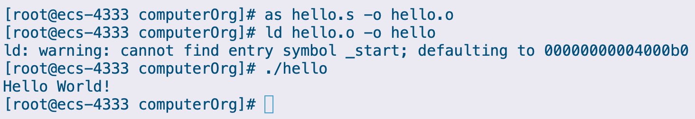

# 基础代码示例程序测试

创建并启动华为云服务器，使用 SSH 登录


登录后，使用 vim 创建 `hello.s` 文件，并将以下源码填入

```assembly
.text
.global tart1
tart1:
	mov x0,#0
	ldr x1,=msg
	mov x2,len
	mov x8,64
	svc #0

	mov x0,123
	mov x8,93
	svc #0

.data
msg:
	.ascii "Hello World!\n"
len=.-msg
```

保存并退出，然后使用 `as` 命令对文件进行汇编

```bash
$ as hello.s -o hello.o
```

随后使用 `ld` 命令进行链接

```bash
$ ld hello.o -o hello
```

期间弹出 `warning` 提示找不到 `_start` 符号，所以把 `_start` 这一入口点设置在了地址 `0x04000b0`

尝试运行程序，结果如图



完成基础程序测试