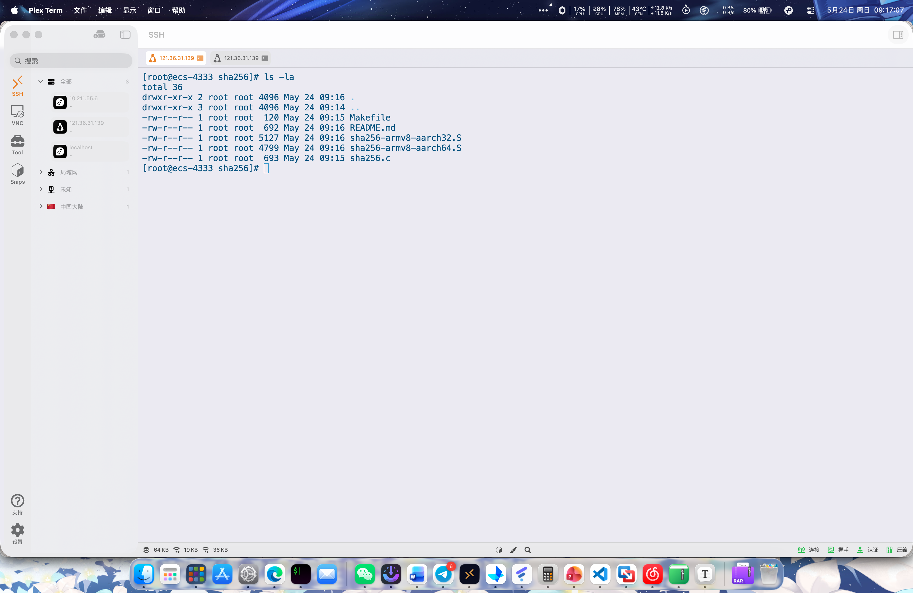
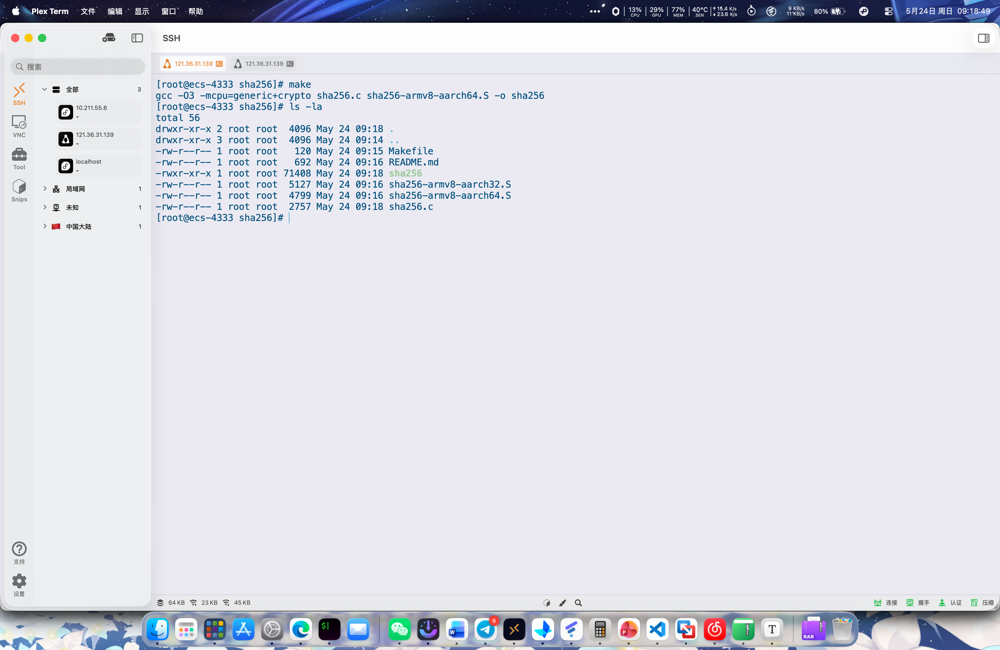
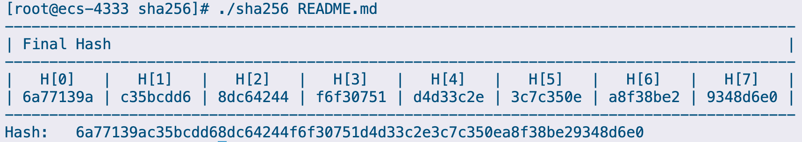

# 密码运算

由题意，新建几个源码文件

- sha256.c
- sha256-armv8-aarch32.S
- sha256-armv8-aarch64.S
- Makefile
- README.md

新建完成后，当前目录文件如下

运行 `make` 命令进行编译，运行完成后，当前目录出现可执行文件 `sha256`

对 `README.md` 文件进行 sha256 运算，有结果如图

